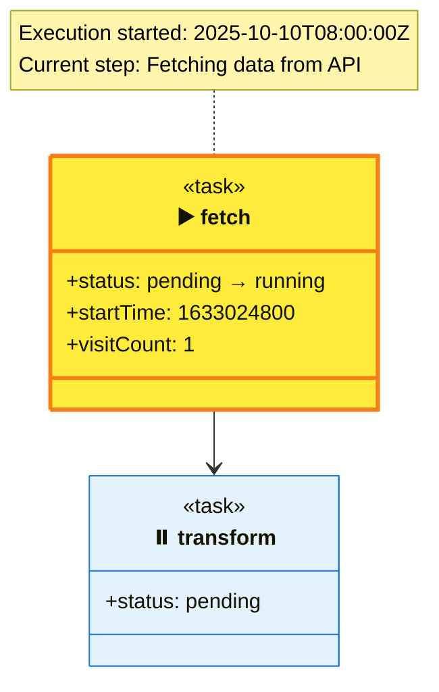

# Advanced Features

This guide covers advanced diagram expressivity features introduced across multiple development phases. These features enhance the semantic richness and visual clarity of DyGram state machines.

## Table of Contents

1. [Relationship Types](#relationship-types)
2. [Multiplicity & Cardinality](#multiplicity--cardinality)
3. [Annotations](#annotations)
4. [Dependency Inference](#dependency-inference)
5. [Generic Types](#generic-types)
6. [Documentation Notes](#documentation-notes)
7. [Runtime Visualization](#runtime-visualization)
8. [Type Checking & Validation](#type-checking--validation)
9. [Graph Validation](#graph-validation)
10. [Semantic Validation](#semantic-validation)

---

## Relationship Types

DyGram supports multiple relationship types to express different semantic meanings between nodes. Each arrow type maps to a specific relationship pattern in Mermaid diagrams.

### Supported Arrow Types

#### 1. Association (`->`)
**Meaning:** Basic connection or transition between nodes.
**Use Case:** Standard workflow transitions, simple relationships.

```dygram
machine "Association Example"
client;
server;
client -> server;
```

**Mermaid Output:** `-->`

[Example: examples/edges/relationship-types.dygram](../examples/edges/relationship-types.dygram)

#### 2. Dependency (`-->`)
**Meaning:** Source depends on target but doesn't own it.
**Use Case:** Configuration dependencies, optional references.

```dygram
machine "Dependency Example"
task process;
context config;
process --> config;  // process depends on config
```

**Mermaid Output:** `..>` (dashed arrow)

#### 3. Inheritance (`<|--`)
**Meaning:** "is-a" relationship where child inherits from parent.
**Use Case:** Type hierarchies, specialized behaviors.

```dygram
machine "Inheritance Example"
task BaseProcessor;
task DataProcessor;
BaseProcessor <|-- DataProcessor;  // DataProcessor is a BaseProcessor
```

**Mermaid Output:** `<|--`

#### 4. Composition (`*-->`)
**Meaning:** Strong ownership where components cannot exist independently.
**Use Case:** Lifecycle-bound components, required parts.

```dygram
machine "Composition Example"
task Workflow;
task Step1;
task Step2;
Workflow *--> Step1;  // Workflow owns Step1
Workflow *--> Step2;
```

**Mermaid Output:** `*--`

#### 5. Aggregation (`o-->`)
**Meaning:** Weak ownership where parts can exist independently.
**Use Case:** Shared resources, reusable components.

```dygram
machine "Aggregation Example"
task Team;
task Member;
Team o--> Member;  // Team has members, but members can exist independently
```

**Mermaid Output:** `o--`

#### 6. Bidirectional (`<-->`)
**Meaning:** Two-way relationship or mutual dependency.
**Use Case:** Peer relationships, circular references.

```dygram
machine "Bidirectional Example"
task Parent;
task Child;
Parent <--> Child;  // Parent knows Child, Child knows Parent
```

**Mermaid Output:** `<-->`

#### 7. Fat Arrow (`=>`)
**Meaning:** Strong transition or emphasis.
**Use Case:** Primary flow, critical paths.

```dygram
machine "Fat Arrow Example"
start;
critical;
end;
start => critical;  // Critical path
critical -> end;
```

**Mermaid Output:** `-->` (with emphasis in context)

### Choosing the Right Relationship Type

| Relationship | Ownership | Lifecycle | Use When |
|--------------|-----------|-----------|----------|
| `->` Association | None | Independent | Standard transitions |
| `-->` Dependency | None | Independent | Configuration, optional refs |
| `<\|--` Inheritance | None | Inherited | Type specialization |
| `*-->` Composition | Strong | Bound | Required components |
| `o-->` Aggregation | Weak | Independent | Optional components |
| `<-->` Bidirectional | Mutual | Interdependent | Peer relationships |
| `=>` Fat Arrow | None | Independent | Critical paths |

### Execution Semantics

Relationship types currently affect visual representation and can be used by validation tools to:

- **Inheritance:** Validate type compatibility
- **Composition:** Enforce lifecycle constraints
- **Dependency:** Detect missing required nodes
- **Aggregation:** Track optional component usage

Future versions may leverage these semantics for automatic code generation and runtime enforcement.

---

## Multiplicity & Cardinality

Multiplicity expresses quantitative relationships between nodes, indicating how many instances relate to each other.

### Syntax

```dygram
source "sourceMultiplicity" -> "targetMultiplicity" target
```

### Valid Multiplicity Formats

| Format | Meaning | Example |
|--------|---------|---------|
| `"1"` | Exactly one | One-to-one |
| `"*"` | Zero or more (unlimited) | One-to-many |
| `"0..1"` | Zero or one (optional) | Optional relationship |
| `"1..*"` | One or more (at least one) | Required one-to-many |
| `"0..*"` | Zero or more | Same as `*` |
| `"2..5"` | Specific range | Between 2 and 5 |

### Examples

#### One-to-Many
```dygram
machine "One-to-Many"
task User;
task Order;
User "1" -> "*" Order;  // One user has many orders
```

#### One-to-One
```dygram
machine "One-to-One"
task Order;
task Payment;
Order "1" -> "1" Payment;  // One order has exactly one payment
```

#### Many-to-Many
```dygram
machine "Many-to-Many"
task Student;
task Course;
Student "*" -> "*" Course;  // Students take multiple courses
```

#### Optional Relationship
```dygram
machine "Optional"
task User;
task Profile;
User "1" -> "0..1" Profile;  // User may have a profile
```

### Validation

The validator checks:
- ✅ Multiplicity format is valid
- ✅ Lower bound ≤ upper bound in ranges
- ⚠️ Warns if multiplicity seems unusual (e.g., `"5..*"`)

[Example: examples/phase2/multiplicity.dygram](../examples/phase2/multiplicity.dygram)

---

## Annotations

Annotations provide semantic metadata about nodes using the `@Name` or `@Name("value")` syntax.

### Syntax

```dygram
task myTask @Async @Deprecated("Use newTask instead") {
    // attributes
}
```

### Common Annotations

| Annotation | Meaning | Applies To |
|------------|---------|------------|
| `@Abstract` | Cannot be instantiated | task, state |
| `@Singleton` | Single instance only | task, context |
| `@Deprecated("reason")` | Marked for removal | any |
| `@Async` | Asynchronous execution | task |
| `@Critical` | Critical path component | task, state |

### Examples

#### Abstract Task
```dygram
machine "Abstract Base"
task BaseHandler @Abstract {
    prompt: "Base handler that must be overridden";
}

task ConcreteHandler {
    prompt: "Concrete implementation";
}

BaseHandler <|-- ConcreteHandler;
```

#### Singleton Context
```dygram
machine "Singleton Pattern"
context AppConfig @Singleton {
    apiKey<string>: "secret";
}
```

#### Deprecated Node
```dygram
machine "Migration"
task oldProcess @Deprecated("Use newProcess instead") {
    prompt: "Legacy processing";
}

task newProcess {
    prompt: "Updated processing";
}
```

### Rendering

Annotations appear as stereotypes in Mermaid diagrams:
```mermaid
class BaseHandler {
  <<task>>
  <<Abstract>>
}
```

### Validation

The validator enforces:
- ✅ `@Async` only on task nodes
- ✅ `@Singleton` on task or context nodes
- ✅ `@Abstract` not on init nodes
- ⚠️ Warns on deprecated node usage

[Example: examples/phase2/annotations.dygram](../examples/phase2/annotations.dygram)

---

## Dependency Inference

DyGram automatically infers dependencies from template variable references in prompts and attribute values.

### How It Works

When you reference a context attribute using `{{ nodeName.attributeName }}`, the system automatically:
1. Detects the template variable
2. Resolves the target node
3. Creates an inferred dependency edge
4. Validates that the reference exists

### Syntax

```dygram
context config {
    apiKey<string>: "secret123";
    endpoint<string>: "https://api.example.com";
}

task apiCall {
    prompt: "Call {{ config.endpoint }} with key {{ config.apiKey }}";
}
```

**Generated:** `apiCall ..> config : reads apiKey, endpoint`

### Benefits

1. **Automatic Documentation:** Dependencies are visualized without manual edge creation
2. **Validation:** Missing references are detected at compile time
3. **Refactoring Safety:** Renaming a context node highlights all dependents

### Complex References

#### Nested Access
```dygram
context settings {
    api {
        timeout<number>: 5000;
    }
}

task request {
    prompt: "Timeout after {{ settings.api.timeout }}ms";
}
```

#### Multiple Dependencies
```dygram
context userConfig {
    name<string>: "Alice";
}

context systemConfig {
    mode<string>: "production";
}

task greet {
    prompt: "Hello {{ userConfig.name }}, running in {{ systemConfig.mode }}";
}
```

**Generated:**
```
greet ..> userConfig : reads name
greet ..> systemConfig : reads mode
```

### Validation

The validator checks:
- ✅ Referenced node exists
- ✅ Referenced attribute exists
- ✅ Type compatibility
- ⚠️ Warns on circular dependencies

[Example: examples/phase2/dependency-inference.dygram](../examples/phase2/dependency-inference.dygram)

---

## Generic Types

Generic types allow you to specify parameterized types for attributes, enhancing type safety and documentation.

### Syntax

Use angle brackets for generic type parameters:
```dygram
node {
    attribute<GenericType<TypeParam>>: value;
}
```

### Supported Generic Patterns

#### Promise Types
```dygram
task fetchData {
    response<Promise<Response>>: "pending";
}
```

#### Collection Types
```dygram
task processRecords {
    data<Array<Record>>: [];
    lookup<Map<string, User>>: [];
}
```

#### Nested Generics
```dygram
task asyncBatch {
    results<Promise<Array<Result>>>: [];
}
```

### Mermaid Rendering

Generic types are converted to Mermaid's tilde syntax:
```
Promise<Result> → Promise~Result~
Array<Record> → Array~Record~
Map<K,V> → Map~K,V~
```

### Benefits

1. **Type Documentation:** Clear type contracts in diagrams
2. **Validation:** Future type checking can leverage generic info
3. **Code Generation:** Can generate strongly-typed interfaces

### Examples

#### API Response Handling
```dygram
machine "API Client"

task fetchUsers {
    response<Promise<Array<User>>>: [];
}

task cacheResults {
    cache<Map<string, User>>: [];
}

fetchUsers -> cacheResults;
```

#### Event Processing
```dygram
machine "Event System"

task listenEvents {
    stream<Observable<Event>>: null;
}

task handleEvent {
    handler<Function<Event, Promise<void>>>: null;
}

listenEvents -> handleEvent;
```

[Example: examples/phase3/notes-and-generics.dygram](../examples/phase3/notes-and-generics.dygram)

---

## Documentation Notes

Notes attach explanatory documentation to nodes using the `note for` syntax.

### Syntax

```dygram
note for targetNode "Note content goes here"
```

### Examples

#### Single Note
```dygram
machine "Documented System"

task authenticate {
    prompt: "Verify user credentials";
}

note for authenticate "This task validates credentials against the identity provider.
Uses JWT tokens for session management."
```

#### Multiple Notes
```dygram
machine "Complex System"

task critical {
    prompt: "Critical operation";
}

note for critical "IMPORTANT: This is a critical path operation"
note for critical "Must maintain ACID properties"
```

### Multiline Notes

Use `\n` for line breaks:
```dygram
note for processData "Step 1: Validate input\nStep 2: Transform data\nStep 3: Store results"
```

**Rendered:**
```
Step 1: Validate input
Step 2: Transform data
Step 3: Store results
```

### Use Cases

- **Documentation:** Explain complex logic or algorithms
- **Warnings:** Highlight critical constraints or gotchas
- **Context:** Provide background information for maintainers
- **Checklists:** Outline steps or requirements

### Rendering

Notes appear in Mermaid as attached annotations:
```mermaid
class critical {
  <<task>>
}
note for critical "IMPORTANT: This is a critical path operation"
```

[Example: examples/phase3/notes-and-generics.dygram](../examples/phase3/notes-and-generics.dygram)

---

## Runtime Visualization

DyGram provides enhanced runtime visualization that preserves the original diagram structure while adding execution state information.

### Features

#### 1. Execution State Indicators

Nodes display their current execution state:
- ▶️ **Current:** Node currently executing
- ✅ **Visited:** Node completed execution
- ⏸️ **Pending:** Node not yet executed

#### 2. Visit Counts

Track how many times each node has been visited:
```
+status: COMPLETE
+visitCount: 5
```

#### 3. Runtime Attribute Updates

Attribute values updated during execution:
```
+status: PENDING → COMPLETE
+timestamp: 0 → 1633024800
```

#### 4. Execution Notes

Detailed execution history attached as notes:
```
note for taskNode "
Execution History:
- Started: 2025-10-10T08:00:00Z
- Completed: 2025-10-10T08:00:05Z
- Duration: 5s
- Status: SUCCESS
"
```

#### 5. Color Coding

**Node Type Colors (Subtle):**
- Tasks: Light blue (#E3F2FD)
- States: Light purple (#F3E5F5)
- Contexts: Light green (#E8F5E9)
- Init nodes: Light orange (#FFF3E0)

**Runtime Status Colors (Prominent):**
- Current: Bright yellow background
- Visited: Bright green background
- Error: Bright red background

### Example

**Static Machine:**
```dygram
machine "Processing Pipeline"

task fetch {
    status: "pending";
}

task transform {
    status: "pending";
}

fetch -> transform;
```

**Runtime Visualization:**


### Benefits

1. **Non-Intrusive:** Original diagram structure preserved
2. **Rich Context:** Execution history and state clearly visible
3. **Live Updates:** Real-time feedback during execution
4. **Debugging:** Easy to identify bottlenecks and errors

[See: Runtime & Evolution Guide](runtime-and-evolution.md)

---

## Type Checking & Validation

DyGram includes a comprehensive type checking system that validates attribute types and catches type errors early.

### Type Compatibility

The type checker validates:

#### 1. Primitive Types
```dygram
task example {
    name<string>: "Alice";     // ✅ Valid
    count<number>: 42;          // ✅ Valid
    enabled<boolean>: true;     // ✅ Valid

    invalid<number>: "text";    // ❌ Type mismatch
}
```

#### 2. Collection Types
```dygram
task lists {
    items<array>: ["a", "b"];   // ✅ Valid
    empty<array>: [];            // ✅ Valid

    wrong<array>: 42;            // ❌ Type mismatch
}
```

#### 3. Generic Types
```dygram
task async {
    result<Promise<string>>: "pending";  // ✅ Valid
    data<Array<number>>: [1, 2, 3];      // ✅ Valid
}
```

#### 4. Optional Types
```dygram
task optional {
    maybeValue<string?>: null;    // ✅ Valid (optional)
    maybeValue<string?>: "text";  // ✅ Valid (has value)

    required<string>: null;       // ❌ Cannot be null
}
```

### Type Inference

When type annotations are omitted, the type checker infers types from values:

```dygram
task inferred {
    autoString: "hello";      // Inferred: string
    autoNumber: 42;           // Inferred: number
    autoBool: true;           // Inferred: boolean
    autoArray: [1, 2, 3];     // Inferred: array
}
```

### Template Variable Type Checking

The type checker validates template variable references:

```dygram
context config {
    timeout<number>: 5000;
}

task process {
    // ✅ Valid: timeout is a number
    prompt: "Timeout: {{ config.timeout }}ms";

    // ❌ Error: missing attribute
    prompt: "{{ config.nonexistent }}";
}
```

### Validation Messages

| Level | When | Example |
|-------|------|---------|
| **Error** | Type mismatch | `Type mismatch: expected number, got string` |
| **Error** | Undefined reference | `Context reference "config.missing" is undefined` |
| **Warning** | Type inference ambiguity | `Could not infer type for attribute` |
| **Info** | Type widening | `Type widened from integer to number` |

[Example: examples/phase4/type-checking.dygram](../examples/phase4/type-checking.dygram)

---

## Graph Validation

Graph validation ensures structural integrity of the state machine.

### Validation Checks

#### 1. Unreachable Nodes

Detects nodes that cannot be reached from init nodes:

```dygram
machine "Unreachable Example"

init start;
task reachable;
task orphan;  // ⚠️ Warning: Unreachable node

start -> reachable;
// orphan is never reached
```

#### 2. Cycle Detection

Identifies cycles in the graph:

```dygram
machine "Cycle Example"

task a;
task b;
task c;

a -> b;
b -> c;
c -> a;  // ⚠️ Cycle detected: a → b → c → a
```

**Note:** Cycles are not always errors (e.g., loops, retries), but should be intentional.

#### 3. Entry/Exit Point Validation

Ensures proper graph structure:

```dygram
machine "No Entry Point"
// ❌ Error: No init node defined

task a;
task b;
a -> b;
```

#### 4. Orphaned Nodes

Finds nodes with no incoming or outgoing edges:

```dygram
machine "Orphan Example"

init start;
task connected;
task isolated;  // ⚠️ Warning: Orphaned node (no edges)

start -> connected;
```

### Graph Statistics

The validator provides:
- **Node count** by type
- **Edge count** by relationship type
- **Max nesting depth**
- **Connected components** count

### Validation Levels

| Level | Meaning | Action |
|-------|---------|--------|
| **Error** | Structural problem | Must fix |
| **Warning** | Potential issue | Should review |
| **Info** | Interesting fact | FYI |

[Example: examples/phase4/graph-validation.dygram](../examples/phase4/graph-validation.dygram)

---

## Semantic Validation

Semantic validation enforces DyGram's design patterns and best practices.

### Node Type Semantics

#### Init Nodes
**Rule:** Must have outgoing edges (entry points)

```dygram
machine "Init Validation"

init start;  // ❌ Error: Init node has no outgoing edges
```

**Valid:**
```dygram
init start;
task next;
start -> next;  // ✅ Valid
```

#### Context Nodes
**Rule:** Shouldn't have incoming edges (not part of execution flow)

```dygram
machine "Context Validation"

context config {
    value: 42;
}

task setup;
setup -> config;  // ⚠️ Warning: Context node has incoming edge
```

**Valid:**
```dygram
context config {
    value: 42;
}

task setup {
    prompt: "Use {{ config.value }}";  // ✅ Valid (dependency inference)
}
```

### Relationship Semantics

#### Inheritance Validation
**Rule:** Inheritance should be between compatible types

```dygram
machine "Inheritance Validation"

task BaseTask;
context Config;

BaseTask <|-- Config;  // ⚠️ Warning: Inheriting incompatible types
```

**Valid:**
```dygram
task BaseTask;
task SpecializedTask;

BaseTask <|-- SpecializedTask;  // ✅ Valid
```

### Annotation Compatibility

#### @Async Validation
**Rule:** Only on task nodes

```dygram
machine "Async Validation"

state waiting @Async;  // ❌ Error: @Async only valid on tasks
```

**Valid:**
```dygram
task asyncOperation @Async {
    prompt: "Long-running operation";
}
```

#### @Singleton Validation
**Rule:** Only on tasks or contexts

```dygram
machine "Singleton Validation"

init startup @Singleton;  // ❌ Error: @Singleton not valid on init
```

**Valid:**
```dygram
context AppConfig @Singleton {
    apiKey: "secret";
}
```

#### @Abstract Validation
**Rule:** Not on init nodes (must be instantiable)

```dygram
machine "Abstract Validation"

init start @Abstract;  // ❌ Error: Init nodes cannot be abstract
```

**Valid:**
```dygram
task BaseHandler @Abstract {
    prompt: "Override this";
}
```

### Best Practices

1. **Init nodes** - Always have outgoing edges
2. **Context nodes** - Use for configuration, not execution flow
3. **Inheritance** - Use between similar types
4. **Annotations** - Follow semantic rules
5. **Cycles** - Document intentional loops

[Example: examples/phase4/semantic-validation.dygram](../examples/phase4/semantic-validation.dygram)

---

## Complete Example

Here's a comprehensive example using all advanced features:

```dygram
machine "Advanced E-Commerce System"

// Configuration with singleton pattern
context AppConfig @Singleton {
    apiEndpoint<string>: "https://api.example.com";
    maxRetries<number>: 3;
    timeout<number>: 5000;
}

// Abstract base handler
task BaseHandler @Abstract {
    retries<number>: 0;
}

// Concrete handlers inheriting from base
task AuthHandler {
    prompt: "Authenticate user";
}

task OrderHandler @Async {
    prompt: "Process order with {{ AppConfig.maxRetries }} retries";
    orderData<Promise<Order>>: null;
}

BaseHandler <|-- AuthHandler;
BaseHandler <|-- OrderHandler;

// User flow with multiplicity
task User;
task Order;
User "1" -> "*" Order;  // One user has many orders

// Composition: Order owns LineItems
task Order;
task LineItem;
Order "1" *--> "1..*" LineItem;  // Order must have at least one item

// Processing pipeline
init start "User Session Start";
state authenticated "Authenticated State";
state error "Error State";

start -> AuthHandler;
AuthHandler --> AppConfig;  // Depends on config
AuthHandler -"success"-> authenticated;
AuthHandler -"failure"-> error;
authenticated -> OrderHandler;
OrderHandler -"success"-> Order;

note for AuthHandler "Authenticates user credentials.
Uses JWT tokens with {{ AppConfig.timeout }}ms timeout.
Retries up to {{ AppConfig.maxRetries }} times on failure."

note for OrderHandler "Asynchronous order processing.
Creates order and line items atomically.
Validates inventory before committing."
```

**This example demonstrates:**
- ✅ Relationship types (dependency, inheritance, composition, association)
- ✅ Multiplicity (1-to-many, 1-to-at-least-one)
- ✅ Annotations (@Singleton, @Abstract, @Async)
- ✅ Dependency inference (template variables)
- ✅ Generic types (Promise\<Order\>)
- ✅ Documentation notes
- ✅ Type validation
- ✅ Semantic validation

[Example: examples/phase4/complete-validated.dygram](../examples/phase4/complete-validated.dygram)

---

## Summary

DyGram's advanced features provide:

1. **Rich Semantics** - Express intent clearly with relationship types
2. **Quantitative Relationships** - Specify cardinality with multiplicity
3. **Metadata** - Add annotations for tooling and documentation
4. **Automatic Analysis** - Infer dependencies from template variables
5. **Type Safety** - Generic types and type checking
6. **Documentation** - Inline notes for maintainability
7. **Runtime Insight** - Enhanced visualization during execution
8. **Validation** - Type, graph, and semantic validation

These features work together to create expressive, validated, and well-documented state machines that serve as both specification and implementation.

---

## Next Steps

- Review [Language Overview](language-overview.md) for basics
- See [Syntax Guide](syntax-guide.md) for complete grammar
- Browse [Examples Index](examples-index.md) for patterns
- Read [Runtime & Evolution](runtime-and-evolution.md) for execution details
- Check [Validation Error Handling](VALIDATION_ERROR_HANDLING.md) for error reference
