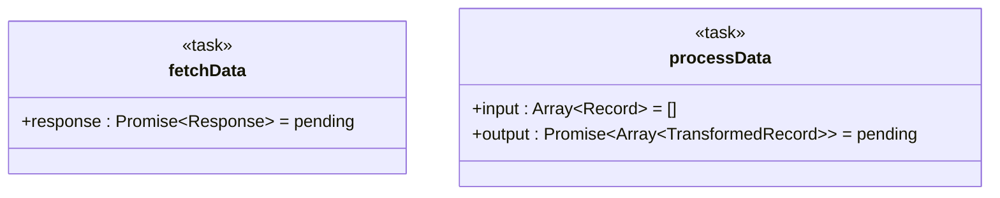
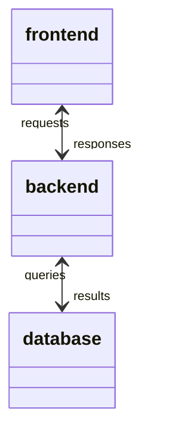

# Advanced Syntax Diagram Expressivity Features

This document describes the Advanced Syntax enhancements to DyGram's diagram expressivity, including note support, generic types, link styling, and bidirectional role names.

## Table of Contents

1. [Note Support](#note-support)
2. [Generic Type Support](#generic-type-support)
3. [Link Styling API](#link-styling-api)
4. [Bidirectional Role Names](#bidirectional-role-names)
5. [Examples](#examples)

---

## Note Support

Notes allow you to attach documentation and explanations directly to nodes in your diagram, making it easier to understand complex workflows and provide context.

### Syntax

```dygram
note <nodeName> "Note content here"
```

### Features

- **Multiline Support**: Notes can contain line breaks for longer documentation
- **Mermaid Integration**: Rendered using Mermaid's `note for` syntax
- **Rich Documentation**: Attach detailed explanations to any node

### Example

```dygram
machine "Documentation Example"

task fetchData {
    url<string>: "https://api.example.com";
}

task processData {
    transform<string>: "normalize";
}

state complete {
    status<string>: "success";
}

fetchData -> processData -> complete;

// Attach documentation notes
note fetchData "Fetches data from the external API. Includes retry logic with exponential backoff."

note processData "Processes and normalizes the fetched data. Applies schema validation and type checking."

note complete "Final state indicating successful completion of the entire workflow."
```

### Mermaid Output

```mermaid
classDiagram-v2
  class fetchData {
    <<task>>
    +url : string = https://api.example.com
  }

  fetchData --> processData
  processData --> complete

  %% Notes
  note fetchData "Fetches data from the external API..."
  note processData "Processes and normalizes..."
  note complete "Final state indicating..."
```

### Use Cases

1. **API Documentation**: Explain what external APIs are being called
2. **Business Logic**: Describe complex business rules and validations
3. **Error Handling**: Document error scenarios and recovery strategies
4. **Performance Notes**: Highlight performance-critical sections
5. **TODOs**: Mark areas that need future work

### Best Practices

- **Be Concise**: Keep notes focused and relevant
- **Use Markdown**: Notes support basic Markdown formatting
- **Update Regularly**: Keep notes in sync with code changes
- **Prioritize Clarity**: Write notes for future readers

---

## Generic Type Support

Generic types allow you to express parameterized types (like TypeScript generics) in your attribute type annotations, providing better type safety and documentation.

### Syntax

```dygram
attributeName<BaseType<GenericType>>: value;
```

### Supported Patterns

- `Promise<Result>` - Async operations returning a specific type
- `Array<Item>` - Arrays of a specific item type
- `List<T>` - Generic list/collection types
- `Map<Key, Value>` - Key-value mappings
- `Optional<T>` - Nullable/optional types
- Nested generics: `Promise<Array<Record>>`

### Example

```dygram
machine "Generic Types Example"

context config {
    endpoints<Map<string, string>>: ["api", "https://api.example.com"];
    headers<Array<string>>: ["Authorization", "Bearer token"];
}

task fetchData @Async {
    response<Promise<Response>>: "pending";
    retries<number>: 3;
}

task processData {
    input<Array<Record>>: [];
    output<Promise<Array<TransformedRecord>>>: "pending";
}

state result {
    data<Optional<Array<Record>>>: "none";
    error<Optional<Error>>: "none";
}
```

### Mermaid Output

Generic types are converted to Mermaid's tilde syntax:



### Type Conversion

DyGram automatically converts angle brackets to Mermaid tildes:

| DyGram Syntax | Mermaid Output | Description |
|---------------|----------------|-------------|
| `Promise<Result>` | `Promise~Result~` | Async promise type |
| `Array<Item>` | `Array~Item~` | Array of items |
| `Map<K, V>` | `Map~K, V~` | Key-value map |
| `List<T>` | `List~T~` | Generic list |
| `Optional<T>` | `Optional~T~` | Optional/nullable |

### Benefits

1. **Type Safety**: Express expected types clearly
2. **Better Documentation**: Self-documenting attribute types
3. **IDE Support**: Enable better autocomplete and type checking
4. **Code Generation**: Support for typed code generation
5. **Validation**: Enable runtime type validation

### Best Practices

- **Use Standard Types**: Stick to common generic types (Promise, Array, Map, etc.)
- **Document Complex Types**: Add notes for custom generic types
- **Match Implementation**: Keep types aligned with actual code
- **Avoid Over-Specification**: Don't add types where they don't add value

---

## Link Styling API

Link styling allows you to customize the visual appearance of edges based on their semantic meaning, making diagrams more expressive and easier to understand.

### Syntax

```dygram
// Inline style annotation (planned feature)
source @style("stroke: red; stroke-width: 4px") --> target;

// Semantic styling (automatic based on attributes)
source -on: "error";-> target;  // Renders in red
source -on: "success";-> target;  // Renders in green
source -timeout: 5000;-> target;  // Renders in orange
```

### Automatic Semantic Styling

DyGram automatically applies colors based on edge semantics:

| Edge Type | Color | Use Case |
|-----------|-------|----------|
| `on: "error"` | Red (`#f00`) | Error paths |
| `on: "success"` | Green (`#0f0`) | Success paths |
| `timeout: N` | Orange (`#fa0`) | Timeout transitions |
| `retry: N` | Yellow (`#ff0`) | Retry logic |
| Default | Black | Normal flow |

### Example

```dygram
machine "Styled Edges Example"

task process {
    status<string>: "running";
}

state success {
    message<string>: "Complete";
}

state error {
    message<string>: "Failed";
}

state retry {
    attempts<number>: 0;
}

// Different edge styles based on semantics
process -on: "success";-> success;
process -on: "error";-> error;
process -timeout: 5000;-> retry;
```

### Mermaid Output

```mermaid
classDiagram-v2
  process --> success : on=success
  linkStyle 0 stroke:#0f0,stroke-width:2px

  process --> error : on=error
  linkStyle 1 stroke:#f00,stroke-dasharray:5 5

  process --> retry : timeout=5000
  linkStyle 2 stroke:#fa0,stroke-width:3px
```

### Custom Styles (Future Feature)

```dygram
// Custom CSS-like styling (planned)
source @style("stroke: #blue; stroke-width: 4px; stroke-dasharray: 5 5") --> target;
```

### Benefits

1. **Visual Clarity**: Quickly identify different types of transitions
2. **Error Paths**: Highlight error handling visually
3. **Priority**: Show critical paths with prominent styling
4. **Consistency**: Automatic styling ensures consistency

---

## Bidirectional Role Names

Bidirectional relationships can have role names that clarify the nature of the two-way relationship.

### Syntax

```dygram
source <--roleName1/roleName2--> target;
```

### Example

```dygram
machine "Role Names Example"

state frontend {
    view<string>: "active";
}

state backend {
    api<string>: "running";
}

state database {
    connection<string>: "open";
}

// Bidirectional with role names
frontend <--requests/responses--> backend;
backend <--queries/results--> database;
```

### Mermaid Output



### Use Cases

1. **Client-Server**: `client <--requests/responses--> server`
2. **Parent-Child**: `parent <--manages/belongsTo--> child`
3. **Peer-to-Peer**: `peer1 <--sync/sync--> peer2`
4. **Data Flow**: `source <--pull/push--> sink`

### Best Practices

- **Clear Names**: Use descriptive role names
- **Consistent Direction**: Keep direction consistent (source/target)
- **Avoid Redundancy**: Don't repeat information from node names

---

## Complete Example

Here's a comprehensive example using all Advanced Syntax features:

```dygram
machine "Advanced Syntax Complete Demo"

// Configuration with generic types
context apiConfig @Singleton {
    endpoint<string>: "https://api.example.com";
    headers<Map<string, string>>: ["auth", "Bearer token"];
    retries<number>: 3;
}

// Abstract base with generic types
task BaseTask @Abstract {
    result<Promise<any>>: "pending";
    status<string>: "initialized";
}

// Concrete tasks
task FetchTask @Async {
    data<Promise<Response>>: "pending";
}

task TransformTask {
    output<Array<Record>>: [];
}

// States
state Success {
    data<Optional<Array<Record>>>: "none";
}

state Error {
    error<Optional<string>>: "none";
}

// Relationships
BaseTask <|-- FetchTask;
BaseTask <|-- TransformTask;

// Edges with semantic styling
FetchTask "1" -on: "success";-> TransformTask;
FetchTask "1" -on: "error";-> Error;
FetchTask "1" -timeout: 5000;-> FetchTask;  // Retry on timeout

TransformTask "1" --> "1" Success;
TransformTask "1" --> "0..1" Error;

// Bidirectional communication
FetchTask <--request/response--> apiConfig;

// Documentation notes
note apiConfig "Singleton configuration for API access. Contains endpoint, headers, and retry policy."

note FetchTask "Asynchronous task that fetches data from external API. Returns Promise<Response> which resolves to the HTTP response. Includes automatic retry logic with exponential backoff."

note TransformTask "Transforms the raw API response into a typed array of records. Handles schema validation, type coercion, and error reporting."

note Success "Indicates successful completion. Contains the transformed data as Optional<Array<Record>>."

note Error "Error state with optional error message. Captured from API failures or transformation errors."
```

This generates a rich, well-documented diagram with:
- ✅ Generic types throughout (`Promise<Response>`, `Array<Record>`, etc.)
- ✅ Comprehensive documentation via notes
- ✅ Semantic edge styling (success=green, error=red, timeout=orange)
- ✅ Bidirectional relationships with role names
- ✅ Type hierarchies with inheritance
- ✅ Multiplicity constraints from expressivity
- ✅ Annotations from expressivity

---

## Migration from expressivity to Advanced Syntax

Advanced Syntax is **fully backward compatible** with expressivity. Existing diagrams continue to work without modification.

### Enhancements You Can Add

1. **Add Notes**: Document complex nodes with explanatory notes
2. **Use Generic Types**: Make types more specific (e.g., `Array` → `Array<string>`)
3. **Add Role Names**: Clarify bidirectional relationships
4. **Leverage Semantic Styling**: Use `on:`, `timeout:` attributes for automatic styling

### Example Migration

**expressivity**:
```dygram
machine "User API"

task fetchUser {
    id<number>: 1;
}

task processUser {
    data: "{}";
}

fetchUser -> processUser;
```

**Advanced Syntax Enhanced**:
```dygram
machine "User API"

task fetchUser @Async {
    id<number>: 1;
    result<Promise<User>>: "pending";
}

task processUser {
    data<Optional<User>>: "none";
}

fetchUser -on: "success";-> processUser;

note fetchUser "Fetches user data from the API. Returns Promise<User> which resolves to the user object."

note processUser "Processes the fetched user data. Validates schema and updates local state."
```

---

## Best Practices

### Notes
1. Document **why**, not just **what**
2. Keep notes **concise** but **complete**
3. Update notes when code changes
4. Use notes for **complex logic** and **business rules**

### Generic Types
1. Use **standard types** (Promise, Array, Map, etc.)
2. Match types to your **implementation language**
3. Don't over-specify - add types where they **add value**
4. Use `Optional<T>` for nullable values

### Link Styling
1. Use semantic attributes (`on:`, `timeout:`, etc.) for **automatic styling**
2. Reserve custom styles for **special cases**
3. Be **consistent** with color meanings
4. Don't overuse - too many colors create **visual noise**

### Bidirectional Relationships
1. Use descriptive **role names**
2. Keep direction **consistent** (source/target)
3. Avoid **redundant** information
4. Use for **true** bidirectional relationships

---

## Validation

Advanced Syntax adds validation for:

- **Note Targets**: Ensures note targets reference valid nodes
- **Generic Type Syntax**: Validates type syntax (matching < and >)
- **Style Attributes**: Validates CSS-like style syntax (future)
- **Role Names**: Validates bidirectional role name format (future)

---

## Future Enhancements

Planned improvements:

- **Interactive Notes**: Click to expand/collapse notes
- **Custom Style Themes**: User-defined color schemes
- **Type Checking**: Validate type compatibility across edges
- **Auto-Generated Notes**: Generate notes from code comments
- **Note Templates**: Reusable note templates

---

## API Reference

### Note Generation

```typescript
// JSON output includes notes
{
  "notes": [
    {
      "target": "nodeName",
      "content": "Note content"
    }
  ]
}
```

### Generic Type Serialization

```typescript
// Type serialization preserves generic structure
{
  "attributes": [
    {
      "name": "result",
      "type": "Promise<Response>",  // Serialized as string
      "value": "pending"
    }
  ]
}
```

### Mermaid Conversion

```typescript
// Generic types converted to Mermaid format
convertTypeToMermaid("Promise<Result>")  // → "Promise~Result~"
convertTypeToMermaid("Array<Record>")    // → "Array~Record~"
convertTypeToMermaid("Map<K, V>")        // → "Map~K, V~"
```

---

## Execution Semantics

Advanced Syntax features also influence execution behavior:

### Generic Types
- **Type Validation**: Runtime validation of generic types
- **Code Generation**: Generate typed interfaces from generic types
- **Serialization**: Proper serialization of generic type instances

### Notes
- **Runtime Help**: Display notes during execution for context
- **Error Messages**: Include note content in error messages
- **Logging**: Log notes when nodes are visited

### Link Styling
- **Visual Feedback**: Highlight active transitions with styles
- **Performance Monitoring**: Use styles to indicate slow transitions
- **Error Tracking**: Show error paths prominently

---

## Conclusion

Advanced Syntax significantly enhances DyGram's expressivity by adding:

- ✅ **Notes** for comprehensive documentation
- ✅ **Generic Types** for type safety and clarity
- ✅ **Link Styling** for visual expressiveness
- ✅ **Bidirectional Role Names** for relationship clarity

All while maintaining **100% backward compatibility** with relationship types and expressivity diagrams.

For more information, see:
- [RELATIONSHIP_TYPES.md](./RELATIONSHIP_TYPES.md) - relationship types features
- [PHASE2_FEATURES.md](./PHASE2_FEATURES.md) - expressivity features
- [Examples directory](../examples/phase3/) - Working examples
- [Tests](../test/) - Comprehensive test suite
