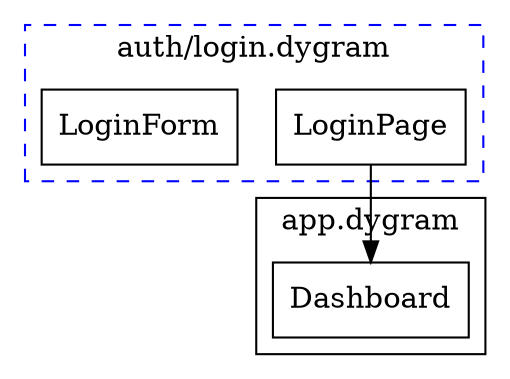
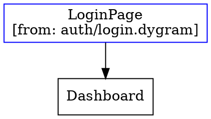
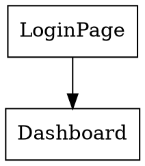

# Import System Integration with Tools and Code Generation

This document explores how the import system integrates with DyGram's tool system (source references) and code generation capabilities.

## Overview

The import system enables modular machine definitions across multiple files. This modularity affects how tools access source code and how generators produce output. This document analyzes the integration points and provides recommendations.

## 1. Integration with Tools (Source References)

### Current Tool System

DyGram's executor provides tools that can interact with the machine structure:
- `get_machine_definition` - Returns current machine structure
- `add_node`, `add_edge` - Modify machine at runtime
- Meta-programming capabilities for self-modification

### Import System Impact

**Challenge:** When a machine imports nodes from other files, the "machine definition" spans multiple source files. Tools need to understand this multi-file context.

**Integration Points:**

#### 1.1 Source Tracking in Tools

The `MultiFileGenerator` already tracks source metadata:

```typescript
interface SourceMetadata {
    sourceFile: string;      // Original file path
    sourceLine: number;      // Line number in source
    importedBy: string[];    // Files that import this node
}
```

**Recommendation:** Extend tool responses to include source metadata:

```typescript
{
    name: 'get_machine_definition',
    description: 'Get machine structure with source file information',
    input_schema: {
        type: 'object',
        properties: {
            includeSourceInfo: {
                type: 'boolean',
                description: 'Include source file metadata for each node'
            }
        }
    }
}
```

**Example Response:**

```json
{
    "nodes": [
        {
            "name": "LoginPage",
            "type": "state",
            "source": {
                "file": "/auth/login.dygram",
                "line": 5,
                "importedBy": ["/app.dygram"]
            }
        }
    ]
}
```

#### 1.2 Cross-File Modification Tools

When machines are composed from imports, modification tools need to respect module boundaries:

**New Tool: `get_import_graph`**

```typescript
{
    name: 'get_import_graph',
    description: 'Get the dependency graph of imported modules',
    input_schema: {
        type: 'object',
        properties: {
            entryPoint: {
                type: 'string',
                description: 'Entry point file (defaults to current machine)'
            }
        }
    }
}
```

**Response:**

```json
{
    "entryPoint": "/app.dygram",
    "imports": [
        {
            "path": "/auth/login.dygram",
            "symbols": ["LoginPage", "LoginForm"],
            "transitiveImports": ["/auth/session.dygram"]
        }
    ],
    "dependencyOrder": [
        "/auth/session.dygram",
        "/auth/login.dygram",
        "/app.dygram"
    ]
}
```

#### 1.3 Scoped Modification

When adding/modifying nodes via tools, respect module boundaries:

**Enhanced: `add_node` with scope**

```typescript
{
    name: 'add_node',
    description: 'Add node to machine or imported module',
    input_schema: {
        type: 'object',
        properties: {
            name: { type: 'string' },
            type: { type: 'string' },
            attributes: { type: 'object' },
            targetFile: {
                type: 'string',
                description: 'File to add node to (defaults to main machine)',
                optional: true
            }
        }
    }
}
```

**Behavior:**
- If `targetFile` is specified, modify that imported module
- If omitted, add to main machine file
- Validate permissions (can only modify files in project scope)

#### 1.4 Import-Aware Context

Context access tools should expose imported contexts:

**Enhanced: `get_context`**

```typescript
{
    name: 'get_context',
    description: 'Get context with import awareness',
    input_schema: {
        type: 'object',
        properties: {
            includeImported: {
                type: 'boolean',
                description: 'Include contexts from imported modules'
            },
            sourceFile: {
                type: 'string',
                description: 'Filter by source file'
            }
        }
    }
}
```

**Response:**

```json
{
    "contexts": [
        {
            "name": "config",
            "attributes": {...},
            "source": {
                "file": "/config.dygram",
                "importedBy": ["/app.dygram"]
            }
        }
    ]
}
```

### Implementation Roadmap

**Phase 1: Read-Only Source Awareness**
1. Extend `get_machine_definition` to include source metadata
2. Add `get_import_graph` tool
3. Update executor to propagate source info

**Phase 2: Cross-File Modification**
1. Add `targetFile` parameter to modification tools
2. Implement file-scoped modifications
3. Add validation for cross-file modifications

**Phase 3: Import Management Tools**
1. Add `add_import` tool
2. Add `remove_import` tool
3. Add `resolve_symbol` tool (find which file exports a symbol)

---

## 2. Integration with Code Generation

### Current Code Generation

DyGram generators produce various outputs:
- **JSON** - Machine structure
- **Graphviz/DOT** - Diagram visualization
- **HTML** - Interactive diagrams
- **DSL** - Original DyGram syntax

### Import System Impact

**Challenge:** Generators must handle multi-file machines and decide how to represent import relationships in output.

### 2.1 JSON Generation with Imports

**Current Behavior:**
The `MultiFileGenerator` merges all imports into a single machine. JSON generation sees a "flattened" machine.

**Options:**

**Option A: Flat Generation (Current)**
- Merge all imports before generating JSON
- Pros: Simple, works with existing tools
- Cons: Loses modularity information

**Option B: Hierarchical Generation (Recommended)**
- Preserve module structure in JSON
- Include import graph metadata
- Maintain source file references

**Example Output:**

```json
{
    "entryPoint": "/app.dygram",
    "modules": [
        {
            "path": "/auth/login.dygram",
            "exports": ["LoginPage", "LoginForm"],
            "nodes": [...],
            "edges": [...]
        },
        {
            "path": "/app.dygram",
            "imports": [
                {
                    "from": "/auth/login.dygram",
                    "symbols": ["LoginPage"]
                }
            ],
            "nodes": [...],
            "edges": [...]
        }
    ],
    "merged": {
        "nodes": [...],
        "edges": [...]
    }
}
```

**Benefits:**
- Tools can understand module boundaries
- Easier debugging (know which file defines each node)
- Supports future package/library systems
- Maintains traceability

### 2.2 Graphviz Generation with Imports

**Visual Representation:**

Graphviz output should visually distinguish imported vs. local nodes:

**Option 1: Subgraphs by Module**



**Option 2: Color Coding**



**Option 3: Annotations**



**Recommendation:** Use **Option 1 (Subgraphs)** for small projects, **Option 2 (Color Coding)** for medium projects, **Option 3 (Flat with annotations)** for large projects.

### 2.3 DSL Generation with Imports

**Goal:** Generate valid DyGram syntax that preserves imports.

**Single File Output:**
When generating a single .dygram file (e.g., via `bundle` command), merge all imports:

```dy
machine "Bundled Application"

// Merged from auth/login.dygram
state LoginPage "User Login"
state LoginForm "Login Form"

// Merged from app.dygram
state Dashboard "Dashboard"

LoginPage --> Dashboard
```

**Multi-File Output:**
When generating multi-file output (e.g., refactoring or splitting), preserve import structure:

**File: auth/login.dygram**
```dy
machine "Authentication"

state LoginPage "User Login"
state LoginForm "Login Form"

LoginPage --> LoginForm
```

**File: app.dygram**
```dy
import { LoginPage } from "./auth/login.dygram"

machine "Application"

state Dashboard "Dashboard"

LoginPage --> Dashboard
```

### 2.4 Code Generation from Templates

**Challenge:** When using DyGram to generate code (e.g., TypeScript, Python), imports should map to target language imports.

**Example Scenario:**

```dy
// auth.dygram
machine "Auth"
state Login
state Session
```

```dy
// app.dygram
import { Login } from "./auth.dygram"

machine "App"
state Dashboard

Login --> Dashboard
```

**Generated TypeScript:**

```typescript
// auth.ts
export class Login {
    name = "Login";
}

export class Session {
    name = "Session";
}
```

```typescript
// app.ts
import { Login } from "./auth";

export class Dashboard {
    name = "Dashboard";
}

export const workflow = {
    nodes: [new Login(), new Dashboard()],
    edges: [{ from: "Login", to: "Dashboard" }]
};
```

**Implementation:**

```typescript
interface CodeGenerator {
    generateModule(module: ModuleInfo): string;
    generateImport(importStmt: ImportStatement): string;
    generateExport(symbol: SymbolInfo): string;
}

class TypeScriptGenerator implements CodeGenerator {
    generateModule(module: ModuleInfo): string {
        const imports = module.imports
            .map(i => this.generateImport(i))
            .join('\n');

        const exports = module.nodes
            .map(n => this.generateExport(n))
            .join('\n\n');

        return `${imports}\n\n${exports}`;
    }

    generateImport(importStmt: ImportStatement): string {
        const symbols = importStmt.symbols
            .map(s => s.alias ? `${s.name} as ${s.alias}` : s.name)
            .join(', ');

        const path = importStmt.path.replace('.dygram', '');
        return `import { ${symbols} } from "${path}";`;
    }
}
```

### Implementation Roadmap

**Phase 1: JSON Enhancement**
1. Add `--preserve-imports` flag to `generate` command
2. Modify JSON generator to output hierarchical structure
3. Include source metadata in nodes

**Phase 2: Graphviz Enhancement**
1. Add `--group-by-module` flag
2. Implement subgraph clustering by file
3. Add color coding for imported nodes

**Phase 3: Code Generation**
1. Create pluggable generator interface
2. Implement TypeScript/Python generators
3. Add import mapping logic

---

## 3. Practical Examples

### Example 1: Debugging with Source References

**Scenario:** Runtime error occurs in imported node. Executor tool shows:

```json
{
    "error": "Invalid transition from LoginPage",
    "node": "LoginPage",
    "source": {
        "file": "/auth/login.dygram",
        "line": 12
    },
    "importedBy": ["/app.dygram"]
}
```

Developer can immediately locate the error in the source file.

### Example 2: Dynamic Module Loading

**Scenario:** LLM agent discovers it needs authentication. Uses tool to add import:

```typescript
add_import({
    path: "/library/auth.dygram",
    symbols: ["Login", "Session"]
})
```

Generator reflects the new import in output JSON:

```json
{
    "imports": [
        {
            "from": "/library/auth.dygram",
            "symbols": ["Login", "Session"],
            "addedAt": "runtime",
            "addedBy": "agent"
        }
    ]
}
```

### Example 3: Code Generation Pipeline

**Scenario:** Convert DyGram workflow to TypeScript state machine:

```bash
dygram generate app.dygram --format typescript --preserve-imports
```

Outputs:
- `auth.ts` - Exported classes from `auth.dygram`
- `app.ts` - Main app with imports from `auth.ts`
- `index.ts` - Entry point tying it all together

---

## 4. Security Considerations

### 4.1 Tool-Based File Access

When tools can access/modify imported files:

**Restrictions:**
1. Only access files within project root
2. No access to absolute paths outside project
3. No access to system files
4. Validate file permissions before modification

**Implementation:**

```typescript
function validateToolFileAccess(requestedPath: string, projectRoot: string): boolean {
    const resolved = path.resolve(projectRoot, requestedPath);
    const relative = path.relative(projectRoot, resolved);

    // Must be within project
    if (relative.startsWith('..') || path.isAbsolute(relative)) {
        throw new Error('Access denied: File outside project scope');
    }

    // No system files
    if (resolved.includes('/etc/') || resolved.includes('/sys/')) {
        throw new Error('Access denied: System files not allowed');
    }

    return true;
}
```

### 4.2 Generated Code Security

When generating code from imports:

**Validation:**
1. Sanitize imported symbol names (prevent code injection)
2. Validate import paths (prevent path traversal)
3. Sandbox code generation (prevent arbitrary execution)

---

## 5. Recommendations

### For Tools Integration

1. **Phase 1 (Immediate):**
   - Add source metadata to `get_machine_definition`
   - Add `get_import_graph` tool
   - Document tool behavior with imports

2. **Phase 2 (Short-term):**
   - Add cross-file modification capabilities
   - Implement permission validation
   - Add import management tools

3. **Phase 3 (Long-term):**
   - Full meta-programming support for imports
   - Dynamic module loading at runtime
   - Import-aware debugging tools

### For Code Generation

1. **Phase 1 (Immediate):**
   - Add `--preserve-imports` flag to JSON generator
   - Include source metadata in all generated output
   - Document import handling in generators

2. **Phase 2 (Short-term):**
   - Implement hierarchical JSON format
   - Add Graphviz subgraph clustering
   - Create pluggable generator interface

3. **Phase 3 (Long-term):**
   - Target language code generators (TypeScript, Python)
   - Import mapping for cross-language generation
   - Package/library code generation

---

## 6. Conclusion

The import system significantly enhances DyGram's capabilities for modular development. Integrating it with tools and code generation enables:

**For Tools:**
- Source-aware debugging
- Cross-file meta-programming
- Import-aware context access
- Dynamic module management

**For Code Generation:**
- Modular output preserving structure
- Visual distinction of imports in diagrams
- Cross-language code generation
- Traceability from output back to source

**Next Steps:**
1. Implement Phase 1 recommendations
2. Add integration tests
3. Update CLI documentation
4. Create examples demonstrating integration

---

**See Also:**
- [Import System Design](../IMPORT_SYSTEM_DESIGN.md)
- [Import System Low-Level Design](IMPORT_SYSTEM_LOW_LEVEL_DESIGN.md)
- [Import System Implementation Summary](IMPORT_SYSTEM_IMPLEMENTATION_SUMMARY.md)
