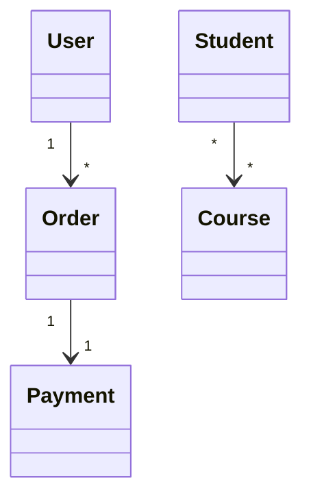
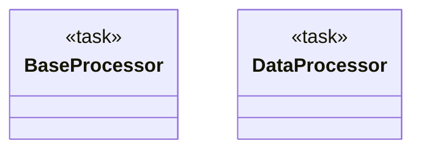
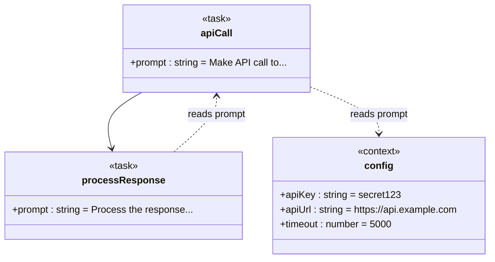

# Expressivity Diagram Expressivity Features

This document describes the Expressivity enhancements to DyGram's diagram expressivity, including multiplicity, annotations, dependency inference, and enhanced runtime visualization.

## Table of Contents

1. [Multiplicity Support](#multiplicity-support)
2. [Annotation System](#annotation-system)
3. [Dependency Inference](#dependency-inference)
4. [Enhanced Runtime Visualization](#enhanced-runtime-visualization)
5. [Examples](#examples)

---

## Multiplicity Support

Multiplicity (also known as cardinality) allows you to express quantitative relationships between nodes, indicating how many instances of one node relate to instances of another.

### Syntax

```dygram
source "sourceMultiplicity" --> "targetMultiplicity" target
```

### Valid Multiplicity Formats

- `"1"` - Exactly one
- `"*"` - Zero or more (unlimited)
- `"0..1"` - Zero or one (optional)
- `"1..*"` - One or more (at least one)
- `"0..*"` - Zero or more (same as `*`)
- `"2..5"` - Between 2 and 5 (specific range)

### Examples

```dygram
machine "Multiplicity Examples"

// One-to-many relationship
task User;
task Order;
User "1" --> "*" Order;  // One user has many orders

// One-to-one relationship
task Order;
task Payment;
Order "1" --> "1" Payment;  // One order has exactly one payment

// Many-to-many relationship
task Student;
task Course;
Student "*" --> "*" Course;  // Many students, many courses

// Optional relationship
task Profile;
task Avatar;
Profile "1" --> "0..1" Avatar;  // Profile may have zero or one avatar

// Specific range
task Team;
task Member;
Team "1" --> "5..12" Member;  // A team has between 5 and 12 members
```

### Mermaid Output

Multiplicity is preserved in the generated Mermaid diagram:



### Validation

The DyGram validator checks:

- **Format validation**: Ensures multiplicity follows valid patterns
- **Range validation**: Warns if lower bound > upper bound (e.g., `"5..2"`)
- **Semantic validation**: Future feature to validate multiplicity matches actual relationships

---

## Annotation System

Annotations provide metadata about nodes, allowing you to mark nodes with special properties or classifications.

### Syntax

```dygram
nodeName @AnnotationName
nodeName @AnnotationName("value")
```

### Common Annotations

- `@Abstract` - Marks a node as abstract (cannot be instantiated)
- `@Singleton` - Marks a node as a singleton (only one instance)
- `@Deprecated` - Marks a node as deprecated
- `@Async` - Marks a task as asynchronous
- `@Critical` - Marks a node as business-critical

### Examples

```dygram
machine "Annotation Examples"

// Abstract base class
task BaseProcessor @Abstract {
    desc: "Base processor that all processors extend";
}

// Concrete implementation
task DataProcessor @Singleton {
    desc: "Processes data (only one instance allowed)";
}
BaseProcessor <|-- DataProcessor;

// Deprecated node
task LegacyProcessor @Deprecated("Use DataProcessor instead") {
    desc: "Old processor - do not use";
}

// Multiple annotations
task CriticalTask @Critical @Async {
    desc: "Critical async task";
    priority: 10;
}
```

### Mermaid Output

Annotations are rendered as stereotypes in Mermaid:



---

## Dependency Inference

DyGram automatically analyzes template variable references and infers dependency relationships. This makes implicit dependencies explicit in the diagram.

### How It Works

When you reference a variable from another node using template syntax (`{{ node.attribute }}`), DyGram automatically:

1. Extracts the template reference
2. Resolves it to a source node
3. Creates an inferred dependency edge
4. Visualizes it with a dashed arrow (`..>`)

### Example

```dygram
machine "Dependency Inference Example"

// Configuration context
context config {
    apiKey<string>: "secret123";
    apiUrl<string>: "https://api.example.com";
    timeout<number>: 5000;
}

// Task that uses configuration
task apiCall {
    prompt: "Make API call to {{ config.apiUrl }} with key {{ config.apiKey }}";
    timeout: 10;
}

// Another task that references the first
task processResponse {
    prompt: "Process the response from {{ apiCall.prompt }}";
}

// Explicit edge
apiCall -> processResponse;
```

### Inferred Dependencies

DyGram will automatically infer:

```
apiCall ..> config : reads prompt
processResponse ..> apiCall : reads prompt
```

### Mermaid Output



### Benefits

- **Explicit Dependencies**: Makes hidden dependencies visible
- **Better Understanding**: Easier to see which nodes depend on which
- **Validation**: Can detect circular dependencies
- **Documentation**: Automatically documents data flows

---

## Enhanced Runtime Visualization

Runtime visualization now includes notes for execution state, subtle colors for node types, and better distinction between static and runtime state.

### Node Type Colors (Subtle)

DyGram applies subtle background colors based on node types:

- **Tasks** (`task`): Light blue (`#E3F2FD`)
- **States** (`state`): Light purple (`#F3E5F5`)
- **Contexts** (`context`): Light green (`#E8F5E9`)
- **Init nodes** (`init`): Light orange (`#FFF3E0`)

### Runtime Status Colors (Prominent)

Runtime status overrides type colors for active nodes:

- **Currently Executing**: Green (`#4CAF50`)
- **Visited**: Blue (`#2196F3`)
- **Pending**: Yellow (`#FFC107`)

### Execution Notes

Runtime diagrams include notes attached to nodes:

- **Current Node**: Shows currently executing node with last transition
- **Recent Steps**: Shows last 5 execution steps with output

### Example

```dygram
machine "Runtime Example"

init start {
    desc: "Starting point";
}

task process {
    prompt: "Processing data";
}

state complete {
    desc: "Completed";
}

start -> process;
process -> complete;
```

### Runtime Mermaid Output

```mermaid
---
title: "Runtime Example [RUNTIME]"
---
classDiagram-v2
  class start["▶️ start"] {
    <<init>>
    +status: CURRENT
    +visits: 0
  }
  class process["⏸️ process"] {
    <<task>>
    +status: PENDING
    +visits: 0
  }

  %% Runtime State Styling
  classDef currentNode fill:#4CAF50,stroke:#2E7D32,stroke-width:4px,color:#fff
  classDef initType fill:#FFF3E0,stroke:#F57C00,stroke-width:2px
  classDef taskType fill:#E3F2FD,stroke:#1976D2,stroke-width:2px

  class start currentNode
  class process taskType

  start --> process

  %% Execution Notes
  note start "Currently executing\nLast transition: initial"

  %% Execution Path:
  %% 1. initial → start (initialize) at 10:30:45
```

### Features

1. **Preserves Original Structure**: Keeps original diagram layout
2. **Adds Runtime Info**: Overlays runtime state without changing structure
3. **Color-Coded Status**: Uses colors to show execution state
4. **Execution Notes**: Attaches notes with execution details
5. **Visit Counts**: Shows how many times each node was visited
6. **Traversal Counts**: Shows how many times each edge was traversed

---

## Complete Example

Here's a comprehensive example using all Expressivity features:

```dygram
machine "Complete Expressivity Example"

// Configuration with dependency inference
context apiConfig @Singleton {
    baseUrl<string>: "https://api.example.com";
    apiKey<string>: "secret";
    retries<number>: 3;
}

// Abstract base task
task BaseTask @Abstract {
    desc: "Base task for all operations";
}

// Concrete tasks with annotations
task FetchData @Async {
    prompt: "Fetch data from {{ apiConfig.baseUrl }}";
    timeout: 5000;
}

task ProcessData @Critical {
    prompt: "Process {{ FetchData.prompt }} results";
    retries: 2;
}

task ValidateData {
    prompt: "Validate the processed data";
}

// Results
state Success {
    desc: "Operation completed successfully";
}

state Error {
    desc: "Operation failed";
}

// Relationships with multiplicity
BaseTask <|-- FetchData;  // Inheritance
BaseTask <|-- ProcessData;  // Inheritance

FetchData "1" --> "1" ProcessData;  // One-to-one flow
ProcessData "1" --> "0..1" ValidateData;  // Optional validation

// Conditional outcomes
ValidateData "1" --> "1" Success;
ValidateData "1" --> "0..1" Error;  // Optional error path

// Inferred dependencies (automatically detected):
// FetchData ..> apiConfig : reads prompt
// ProcessData ..> FetchData : reads prompt
```

This example demonstrates:

- ✅ **Multiplicity**: One-to-one, optional relationships
- ✅ **Annotations**: `@Abstract`, `@Async`, `@Critical`, `@Singleton`
- ✅ **Dependency Inference**: Automatic detection of template variable usage
- ✅ **Inheritance**: Using `<|--` arrows
- ✅ **Type Hierarchy**: Abstract base with concrete implementations
- ✅ **Rich Semantics**: Combines all Expressivity features

---

## Migration Guide

### From relationship types to Expressivity

Expressivity is **fully backward compatible** with relationship types. Existing diagrams continue to work without modification.

#### Optional Enhancements

You can enhance existing diagrams by:

1. **Adding Multiplicity**: Express cardinality in relationships
2. **Adding Annotations**: Document node properties
3. **Leveraging Inference**: Let DyGram detect dependencies automatically
4. **Using Type Colors**: Runtime visualization automatically applies colors

### Example Migration

**relationship types (still works)**:
```dygram
machine "User Management"
task User;
task Order;
User -> Order;
```

**Expressivity (enhanced)**:
```dygram
machine "User Management"

context config {
    maxOrders<number>: 100;
}

task User @Abstract {
    name<string>: "TBD";
}

task Order @Singleton {
    prompt: "Create order for user (max: {{ config.maxOrders }})";
}

User "1" --> "*" Order;  // One user, many orders

// Inferred: Order ..> config : reads prompt
```

---

## Best Practices

### Multiplicity

1. **Be Realistic**: Use multiplicity that matches actual relationships
2. **Document Constraints**: Use specific ranges when known (e.g., `"5..12"`)
3. **Use Optional**: Mark optional relationships with `"0..1"`

### Annotations

1. **Be Consistent**: Use the same annotations across your project
2. **Document Purpose**: Use annotations with values for deprecation messages
3. **Combine Thoughtfully**: Use multiple annotations when needed

### Dependency Inference

1. **Use Template Variables**: Makes dependencies explicit
2. **Organize Contexts**: Group related configuration in context nodes
3. **Review Inferred**: Check generated JSON for inferred dependencies

### Runtime Visualization

1. **Enable Notes**: Set `showExecutionPath: true` for detailed notes
2. **Use Colors**: Colors help quickly identify node states
3. **Monitor Counts**: Visit and traversal counts reveal execution patterns

---

## Validation

Expressivity adds validation for:

- **Multiplicity Format**: Ensures valid multiplicity syntax
- **Multiplicity Ranges**: Warns on invalid ranges
- **Template References**: Plans to validate undefined references (future)
- **Circular Dependencies**: Plans to detect cycles (future)

---

## Future Enhancements

Planned improvements:

- **Type Checking**: Validate types in template variable access
- **Circular Dependency Detection**: Detect and warn about cycles
- **Custom Annotations**: Allow user-defined annotations
- **Multiplicity Constraints**: Enforce multiplicity at runtime
- **Interactive Diagrams**: Click nodes for details

---

## API Reference

### DependencyAnalyzer

```typescript
import { DependencyAnalyzer } from './dependency-analyzer.js';

const analyzer = new DependencyAnalyzer(machine);

// Get all inferred dependencies
const deps = analyzer.inferDependencies();

// Get dependencies for a specific node
const nodeDeps = analyzer.getDependenciesFor('nodeName');

// Check if one node depends on another
const hasDep = analyzer.hasDependency('source', 'target');

// Detect circular dependencies
const cycles = analyzer.detectCircularDependencies();
```

### RuntimeVisualizer

```typescript
import { RuntimeVisualizer } from './runtime-visualizer.js';

const visualizer = new RuntimeVisualizer(executor);

// Generate runtime diagram
const diagram = visualizer.generateRuntimeVisualization({
    showRuntimeValues: true,
    showExecutionPath: true,
    showVisitCounts: true,
    showCurrentState: true,
    format: 'class'  // or 'state', 'hybrid'
});
```

---

## Conclusion

Expressivity significantly enhances DyGram's expressivity, allowing you to:

- Express quantitative relationships with **multiplicity**
- Document node properties with **annotations**
- Make implicit dependencies explicit through **inference**
- Visualize runtime state with **colors and notes**

All while maintaining **100% backward compatibility** with relationship types diagrams.

For more information, see:
- [RELATIONSHIP_TYPES.md](./RELATIONSHIP_TYPES.md) - relationship types relationship types
- [Examples directory](../examples/) - Working examples
- [Tests](../test/) - Comprehensive test suite
