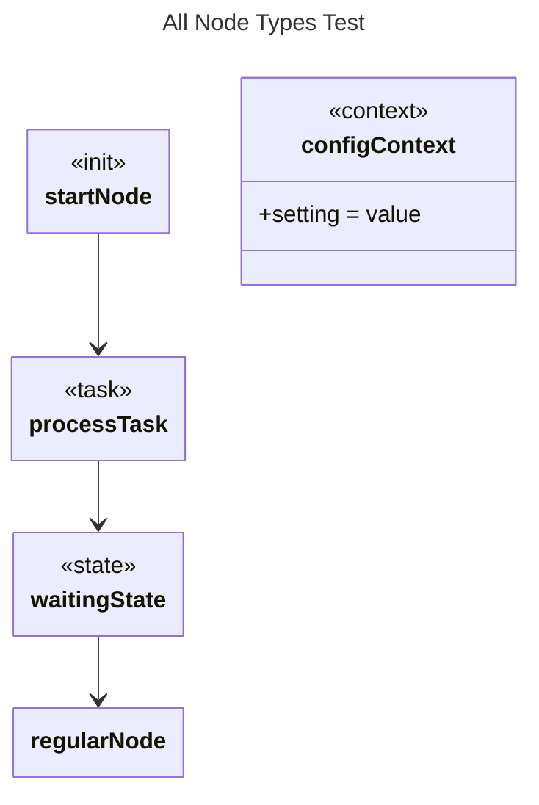

# All Node Types

## Source
```machine
machine "All Node Types Test"
init startNode "Initialization Phase";
task processTask "Process Data";
state waitingState;
context configContext {
    setting: "value";
}

regularNode;

startNode -> processTask;
processTask -> waitingState;
waitingState -> regularNode;
```

## Mermaid Output


## JSON Output
```json
{
  "title": "All Node Types Test",
  "nodes": [
    {
      "name": "startNode",
      "type": "init",
      "attributes": []
    },
    {
      "name": "processTask",
      "type": "task",
      "attributes": []
    },
    {
      "name": "waitingState",
      "type": "state",
      "attributes": []
    },
    {
      "name": "configContext",
      "type": "context",
      "attributes": [
        {
          "name": "setting",
          "value": "\"value\""
        }
      ]
    },
    {
      "name": "regularNode",
      "attributes": []
    }
  ],
  "edges": [
    {
      "source": "startNode",
      "target": "processTask"
    },
    {
      "source": "processTask",
      "target": "waitingState"
    },
    {
      "source": "waitingState",
      "target": "regularNode"
    }
  ]
}
```

## Validation Status
- Passed: true
- Parse Errors: 0
- Transform Errors: 0
- Completeness Issues: 0
- Losslessness Issues: 0
- Mermaid Parse Errors: 0
