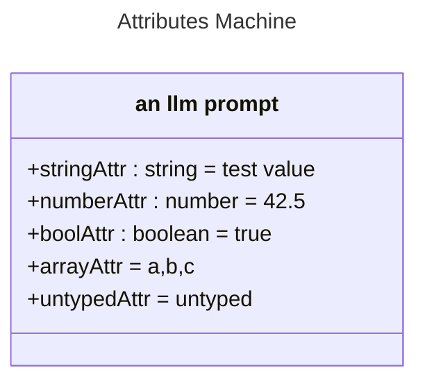

# Basic Attributes

## Source
```machine
machine "Attributes Machine"
node1 {
    stringAttr<string>: "test value";
    numberAttr<number>: 42.5;
    boolAttr<boolean>: true;
    arrayAttr: ["a", "b", "c"];
    untypedAttr: "untyped";
    prompt: "an llm prompt";
}
```

## Mermaid Output


## JSON Output
```json
{
  "title": "Attributes Machine",
  "nodes": [
    {
      "name": "node1",
      "attributes": [
        {
          "name": "stringAttr",
          "type": "string",
          "value": "\"test value\""
        },
        {
          "name": "numberAttr",
          "type": "number",
          "value": "42.5"
        },
        {
          "name": "boolAttr",
          "type": "boolean",
          "value": "true"
        },
        {
          "name": "arrayAttr",
          "value": [
            "a",
            "b",
            "c"
          ]
        },
        {
          "name": "untypedAttr",
          "value": "\"untyped\""
        },
        {
          "name": "prompt",
          "value": "\"an llm prompt\""
        }
      ]
    }
  ],
  "edges": [],
  "notes": [],
  "inferredDependencies": []
}
```

## Validation Status
- Passed: true
- Parse Errors: 0
- Transform Errors: 0
- Completeness Issues: 0
- Losslessness Issues: 0
- Mermaid Parse Errors: 0
