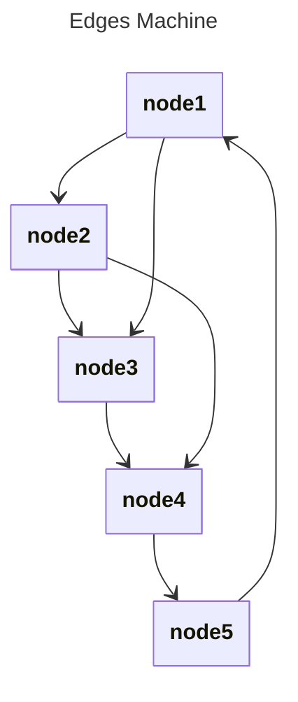

# Basic Edges

## Source
```machine
machine "Edges Machine"
node1;
node2;
node3;
node4;
node5;

node1 -> node2;
node2 -> node3;
node3 -> node4;
node4 -> node5;
node5 -> node1;
node1 -> node3;
node2 -> node4;
```

## Mermaid Output


## JSON Output
```json
{
  "title": "Edges Machine",
  "nodes": [
    {
      "name": "node1",
      "attributes": []
    },
    {
      "name": "node2",
      "attributes": []
    },
    {
      "name": "node3",
      "attributes": []
    },
    {
      "name": "node4",
      "attributes": []
    },
    {
      "name": "node5",
      "attributes": []
    }
  ],
  "edges": [
    {
      "source": "node1",
      "target": "node2"
    },
    {
      "source": "node2",
      "target": "node3"
    },
    {
      "source": "node3",
      "target": "node4"
    },
    {
      "source": "node4",
      "target": "node5"
    },
    {
      "source": "node5",
      "target": "node1"
    },
    {
      "source": "node1",
      "target": "node3"
    },
    {
      "source": "node2",
      "target": "node4"
    }
  ]
}
```

## Validation Status
- Passed: true
- Parse Errors: 0
- Transform Errors: 0
- Completeness Issues: 0
- Losslessness Issues: 0
- Mermaid Parse Errors: 0
