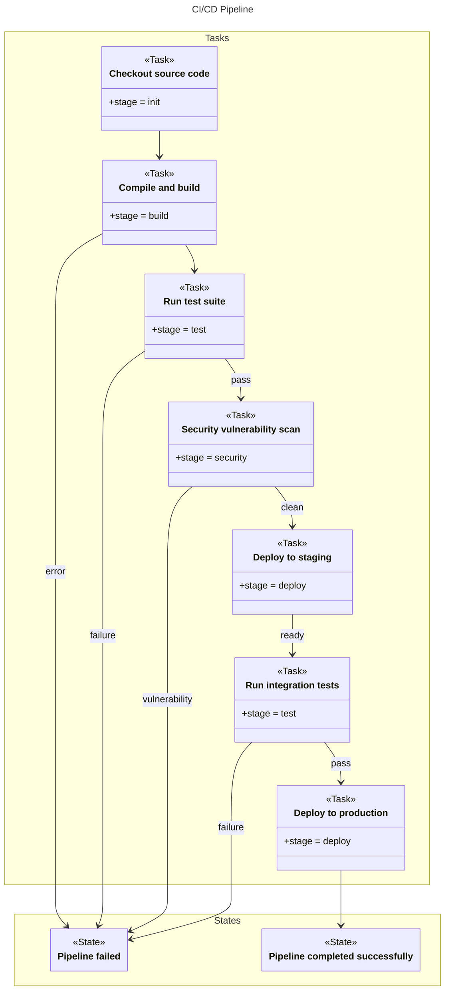

# CI/CD Pipeline

## Source
```machine
machine "CI/CD Pipeline"

// Pipeline stages
Task source {
    desc: "Checkout source code";
    stage: "init";
};

Task build {
    desc: "Compile and build";
    stage: "build";
};

Task test {
    desc: "Run test suite";
    stage: "test";
};

Task security_scan {
    desc: "Security vulnerability scan";
    stage: "security";
};

Task deploy_staging {
    desc: "Deploy to staging";
    stage: "deploy";
};

Task integration_test {
    desc: "Run integration tests";
    stage: "test";
};

Task deploy_production {
    desc: "Deploy to production";
    stage: "deploy";
};

State failed {
    desc: "Pipeline failed";
};

State success {
    desc: "Pipeline completed successfully";
};

// Pipeline flow
source -> build -> test;
test -pass-> security_scan;
security_scan -clean-> deploy_staging;
deploy_staging -ready-> integration_test;
integration_test -pass-> deploy_production;
deploy_production -> success;

// Failure paths
build -error-> failed;
test -failure-> failed;
security_scan -vulnerability-> failed;
integration_test -failure-> failed;

```

## Mermaid Output


## JSON Output
```json
{
  "title": "CI/CD Pipeline",
  "nodes": [
    {
      "name": "source",
      "type": "Task",
      "attributes": [
        {
          "name": "desc",
          "value": "\"Checkout source code\""
        },
        {
          "name": "stage",
          "value": "\"init\""
        }
      ]
    },
    {
      "name": "build",
      "type": "Task",
      "attributes": [
        {
          "name": "desc",
          "value": "\"Compile and build\""
        },
        {
          "name": "stage",
          "value": "\"build\""
        }
      ]
    },
    {
      "name": "test",
      "type": "Task",
      "attributes": [
        {
          "name": "desc",
          "value": "\"Run test suite\""
        },
        {
          "name": "stage",
          "value": "\"test\""
        }
      ]
    },
    {
      "name": "security_scan",
      "type": "Task",
      "attributes": [
        {
          "name": "desc",
          "value": "\"Security vulnerability scan\""
        },
        {
          "name": "stage",
          "value": "\"security\""
        }
      ]
    },
    {
      "name": "deploy_staging",
      "type": "Task",
      "attributes": [
        {
          "name": "desc",
          "value": "\"Deploy to staging\""
        },
        {
          "name": "stage",
          "value": "\"deploy\""
        }
      ]
    },
    {
      "name": "integration_test",
      "type": "Task",
      "attributes": [
        {
          "name": "desc",
          "value": "\"Run integration tests\""
        },
        {
          "name": "stage",
          "value": "\"test\""
        }
      ]
    },
    {
      "name": "deploy_production",
      "type": "Task",
      "attributes": [
        {
          "name": "desc",
          "value": "\"Deploy to production\""
        },
        {
          "name": "stage",
          "value": "\"deploy\""
        }
      ]
    },
    {
      "name": "failed",
      "type": "State",
      "attributes": [
        {
          "name": "desc",
          "value": "\"Pipeline failed\""
        }
      ]
    },
    {
      "name": "success",
      "type": "State",
      "attributes": [
        {
          "name": "desc",
          "value": "\"Pipeline completed successfully\""
        }
      ]
    }
  ],
  "edges": [
    {
      "source": "source",
      "target": "build"
    },
    {
      "source": "build",
      "target": "test"
    },
    {
      "source": "test",
      "target": "security_scan",
      "value": {
        "text": "pass"
      },
      "attributes": {
        "text": "pass"
      }
    },
    {
      "source": "security_scan",
      "target": "deploy_staging",
      "value": {
        "text": "clean"
      },
      "attributes": {
        "text": "clean"
      }
    },
    {
      "source": "deploy_staging",
      "target": "integration_test",
      "value": {
        "text": "ready"
      },
      "attributes": {
        "text": "ready"
      }
    },
    {
      "source": "integration_test",
      "target": "deploy_production",
      "value": {
        "text": "pass"
      },
      "attributes": {
        "text": "pass"
      }
    },
    {
      "source": "deploy_production",
      "target": "success"
    },
    {
      "source": "build",
      "target": "failed",
      "value": {
        "text": "error"
      },
      "attributes": {
        "text": "error"
      }
    },
    {
      "source": "test",
      "target": "failed",
      "value": {
        "text": "failure"
      },
      "attributes": {
        "text": "failure"
      }
    },
    {
      "source": "security_scan",
      "target": "failed",
      "value": {
        "text": "vulnerability"
      },
      "attributes": {
        "text": "vulnerability"
      }
    },
    {
      "source": "integration_test",
      "target": "failed",
      "value": {
        "text": "failure"
      },
      "attributes": {
        "text": "failure"
      }
    }
  ]
}
```

## Validation Status
- Passed: true
- Parse Errors: 0
- Transform Errors: 0
- Completeness Issues: 0
- Losslessness Issues: 0
- Mermaid Parse Errors: 0
