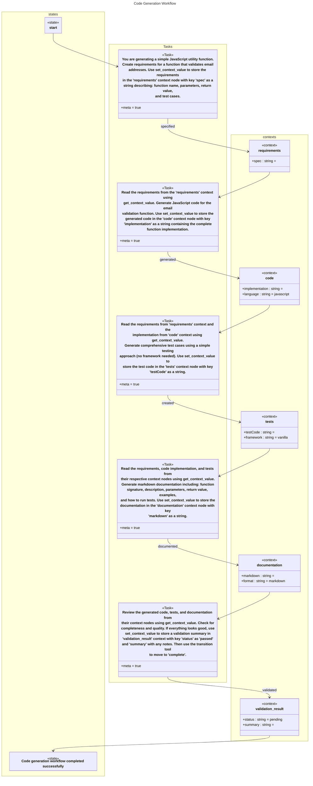

# Code Generation Demo (Advanced Context Management)

## Source
```machine
machine "Code Generation Workflow"

// Define the workflow for generating, testing, and documenting code

state start;

Task define_requirements {
    meta: true;
    prompt: "You are generating a simple JavaScript utility function. Create requirements for a function that validates email addresses. Use set_context_value to store the requirements in the 'requirements' context node with key 'spec' as a string describing: function name, parameters, return value, and test cases.";
};

context requirements {
    spec<string>: "";
};

Task generate_code {
    meta: true;
    prompt: "Read the requirements from the 'requirements' context using get_context_value. Generate JavaScript code for the email validation function. Use set_context_value to store the generated code in the 'code' context node with key 'implementation' as a string containing the complete function implementation.";
};

context code {
    implementation<string>: "";
    language<string>: "javascript";
};

Task generate_tests {
    meta: true;
    prompt: "Read the requirements from 'requirements' context and the implementation from 'code' context using get_context_value. Generate comprehensive test cases using a simple testing approach (no framework needed). Use set_context_value to store the test code in the 'tests' context node with key 'testCode' as a string.";
};

context tests {
    testCode<string>: "";
    framework<string>: "vanilla";
};

Task generate_documentation {
    meta: true;
    prompt: "Read the requirements, code implementation, and tests from their respective context nodes using get_context_value. Generate markdown documentation including: function signature, description, parameters, return value, examples, and how to run tests. Use set_context_value to store the documentation in the 'documentation' context node with key 'markdown' as a string.";
};

context documentation {
    markdown<string>: "";
    format<string>: "markdown";
};

Task validation {
    meta: true;
    prompt: "Review the generated code, tests, and documentation from their context nodes using get_context_value. Check for completeness and quality. If everything looks good, use set_context_value to store a validation summary in 'validation_result' context with key 'status' as 'passed' and 'summary' with any notes. Then use the transition tool to move to 'complete'.";
};

context validation_result {
    status<string>: "pending";
    summary<string>: "";
};

state complete {
    desc: "Code generation workflow completed successfully";
};

// Define the workflow
start -> define_requirements;
define_requirements -specified-> requirements;
requirements -> generate_code;
generate_code -generated-> code;
code -> generate_tests;
generate_tests -created-> tests;
tests -> generate_documentation;
generate_documentation -documented-> documentation;
documentation -> validation;
validation -validated-> validation_result;
validation_result -> complete;

```

## Mermaid Output


## JSON Output
```json
{
  "title": "Code Generation Workflow",
  "nodes": [
    {
      "name": "start",
      "type": "state",
      "attributes": []
    },
    {
      "name": "define_requirements",
      "type": "Task",
      "attributes": [
        {
          "name": "meta",
          "value": "true"
        },
        {
          "name": "prompt",
          "value": "You are generating a simple JavaScript utility function. Create requirements for a function that validates email addresses. Use set_context_value to store the requirements in the 'requirements' context node with key 'spec' as a string describing: function name, parameters, return value, and test cases."
        }
      ]
    },
    {
      "name": "requirements",
      "type": "context",
      "attributes": [
        {
          "name": "spec",
          "type": "string",
          "value": ""
        }
      ]
    },
    {
      "name": "generate_code",
      "type": "Task",
      "attributes": [
        {
          "name": "meta",
          "value": "true"
        },
        {
          "name": "prompt",
          "value": "Read the requirements from the 'requirements' context using get_context_value. Generate JavaScript code for the email validation function. Use set_context_value to store the generated code in the 'code' context node with key 'implementation' as a string containing the complete function implementation."
        }
      ]
    },
    {
      "name": "code",
      "type": "context",
      "attributes": [
        {
          "name": "implementation",
          "type": "string",
          "value": ""
        },
        {
          "name": "language",
          "type": "string",
          "value": "javascript"
        }
      ]
    },
    {
      "name": "generate_tests",
      "type": "Task",
      "attributes": [
        {
          "name": "meta",
          "value": "true"
        },
        {
          "name": "prompt",
          "value": "Read the requirements from 'requirements' context and the implementation from 'code' context using get_context_value. Generate comprehensive test cases using a simple testing approach (no framework needed). Use set_context_value to store the test code in the 'tests' context node with key 'testCode' as a string."
        }
      ]
    },
    {
      "name": "tests",
      "type": "context",
      "attributes": [
        {
          "name": "testCode",
          "type": "string",
          "value": ""
        },
        {
          "name": "framework",
          "type": "string",
          "value": "vanilla"
        }
      ]
    },
    {
      "name": "generate_documentation",
      "type": "Task",
      "attributes": [
        {
          "name": "meta",
          "value": "true"
        },
        {
          "name": "prompt",
          "value": "Read the requirements, code implementation, and tests from their respective context nodes using get_context_value. Generate markdown documentation including: function signature, description, parameters, return value, examples, and how to run tests. Use set_context_value to store the documentation in the 'documentation' context node with key 'markdown' as a string."
        }
      ]
    },
    {
      "name": "documentation",
      "type": "context",
      "attributes": [
        {
          "name": "markdown",
          "type": "string",
          "value": ""
        },
        {
          "name": "format",
          "type": "string",
          "value": "markdown"
        }
      ]
    },
    {
      "name": "validation",
      "type": "Task",
      "attributes": [
        {
          "name": "meta",
          "value": "true"
        },
        {
          "name": "prompt",
          "value": "Review the generated code, tests, and documentation from their context nodes using get_context_value. Check for completeness and quality. If everything looks good, use set_context_value to store a validation summary in 'validation_result' context with key 'status' as 'passed' and 'summary' with any notes. Then use the transition tool to move to 'complete'."
        }
      ]
    },
    {
      "name": "validation_result",
      "type": "context",
      "attributes": [
        {
          "name": "status",
          "type": "string",
          "value": "pending"
        },
        {
          "name": "summary",
          "type": "string",
          "value": ""
        }
      ]
    },
    {
      "name": "complete",
      "type": "state",
      "attributes": [
        {
          "name": "desc",
          "value": "Code generation workflow completed successfully"
        }
      ]
    }
  ],
  "edges": [
    {
      "source": "start",
      "target": "define_requirements",
      "arrowType": "->"
    },
    {
      "source": "define_requirements",
      "target": "requirements",
      "value": {
        "text": "specified"
      },
      "attributes": {
        "text": "specified"
      },
      "arrowType": "->"
    },
    {
      "source": "requirements",
      "target": "generate_code",
      "arrowType": "->"
    },
    {
      "source": "generate_code",
      "target": "code",
      "value": {
        "text": "generated"
      },
      "attributes": {
        "text": "generated"
      },
      "arrowType": "->"
    },
    {
      "source": "code",
      "target": "generate_tests",
      "arrowType": "->"
    },
    {
      "source": "generate_tests",
      "target": "tests",
      "value": {
        "text": "created"
      },
      "attributes": {
        "text": "created"
      },
      "arrowType": "->"
    },
    {
      "source": "tests",
      "target": "generate_documentation",
      "arrowType": "->"
    },
    {
      "source": "generate_documentation",
      "target": "documentation",
      "value": {
        "text": "documented"
      },
      "attributes": {
        "text": "documented"
      },
      "arrowType": "->"
    },
    {
      "source": "documentation",
      "target": "validation",
      "arrowType": "->"
    },
    {
      "source": "validation",
      "target": "validation_result",
      "value": {
        "text": "validated"
      },
      "attributes": {
        "text": "validated"
      },
      "arrowType": "->"
    },
    {
      "source": "validation_result",
      "target": "complete",
      "arrowType": "->"
    }
  ],
  "notes": [],
  "inferredDependencies": []
}
```

## Validation Status
- Passed: true
- Parse Errors: 0
- Transform Errors: 0
- Completeness Issues: 0
- Losslessness Issues: 0
- Mermaid Parse Errors: 0
