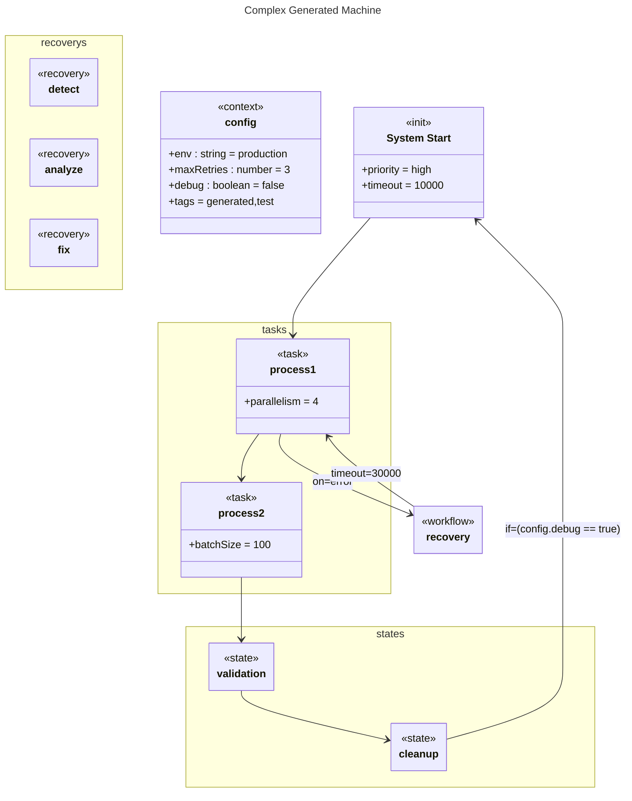

# Complex Machine

## Source
```machine
machine "Complex Generated Machine"

context config {
    env<string>: "production";
    maxRetries<number>: 3;
    debug<boolean>: false;
    tags: ["generated", "test"];
}

init startup "System Start" {
    priority: "high";
    timeout: 10000;
}

task process1 {
    parallelism: 4;
}

task process2 {
    batchSize: 100;
}

state validation;
state cleanup;

workflow recovery {
    detect;
    analyze;
    fix;
    detect -> analyze -> fix;
}

startup -> process1;
process1 -> process2;
process2 -> validation;
validation -> cleanup;
process1 -on: error;-> recovery;
recovery -timeout: 30000;-> process1;
cleanup -if: '(config.debug == true)';-> startup;
```

## Mermaid Output


## JSON Output
```json
{
  "title": "Complex Generated Machine",
  "nodes": [
    {
      "name": "config",
      "type": "context",
      "attributes": [
        {
          "name": "env",
          "type": "string",
          "value": "\"production\""
        },
        {
          "name": "maxRetries",
          "type": "number",
          "value": "3"
        },
        {
          "name": "debug",
          "type": "boolean",
          "value": "false"
        },
        {
          "name": "tags",
          "value": [
            "generated",
            "test"
          ]
        }
      ]
    },
    {
      "name": "startup",
      "type": "init",
      "attributes": [
        {
          "name": "priority",
          "value": "\"high\""
        },
        {
          "name": "timeout",
          "value": "10000"
        }
      ],
      "title": "System Start"
    },
    {
      "name": "process1",
      "type": "task",
      "attributes": [
        {
          "name": "parallelism",
          "value": "4"
        }
      ]
    },
    {
      "name": "process2",
      "type": "task",
      "attributes": [
        {
          "name": "batchSize",
          "value": "100"
        }
      ]
    },
    {
      "name": "validation",
      "type": "state",
      "attributes": []
    },
    {
      "name": "cleanup",
      "type": "state",
      "attributes": []
    },
    {
      "name": "recovery",
      "type": "workflow",
      "attributes": []
    },
    {
      "name": "detect",
      "type": "recovery",
      "attributes": []
    },
    {
      "name": "analyze",
      "type": "recovery",
      "attributes": []
    },
    {
      "name": "fix",
      "type": "recovery",
      "attributes": []
    }
  ],
  "edges": [
    {
      "source": "startup",
      "target": "process1",
      "arrowType": "->"
    },
    {
      "source": "process1",
      "target": "process2",
      "arrowType": "->"
    },
    {
      "source": "process2",
      "target": "validation",
      "arrowType": "->"
    },
    {
      "source": "validation",
      "target": "cleanup",
      "arrowType": "->"
    },
    {
      "source": "process1",
      "target": "recovery",
      "value": {
        "text": "on: error;",
        "on": "error"
      },
      "attributes": {
        "text": "on: error;",
        "on": "error"
      },
      "arrowType": "->"
    },
    {
      "source": "recovery",
      "target": "process1",
      "value": {
        "text": "timeout: 30000;",
        "timeout": "30000"
      },
      "attributes": {
        "text": "timeout: 30000;",
        "timeout": "30000"
      },
      "arrowType": "->"
    },
    {
      "source": "cleanup",
      "target": "startup",
      "value": {
        "if": "(config.debug == true)"
      },
      "attributes": {
        "if": "(config.debug == true)"
      },
      "arrowType": "->"
    }
  ],
  "notes": [],
  "inferredDependencies": []
}
```

## Validation Status
- Passed: true
- Parse Errors: 0
- Transform Errors: 0
- Completeness Issues: 0
- Losslessness Issues: 0
- Mermaid Parse Errors: 0
