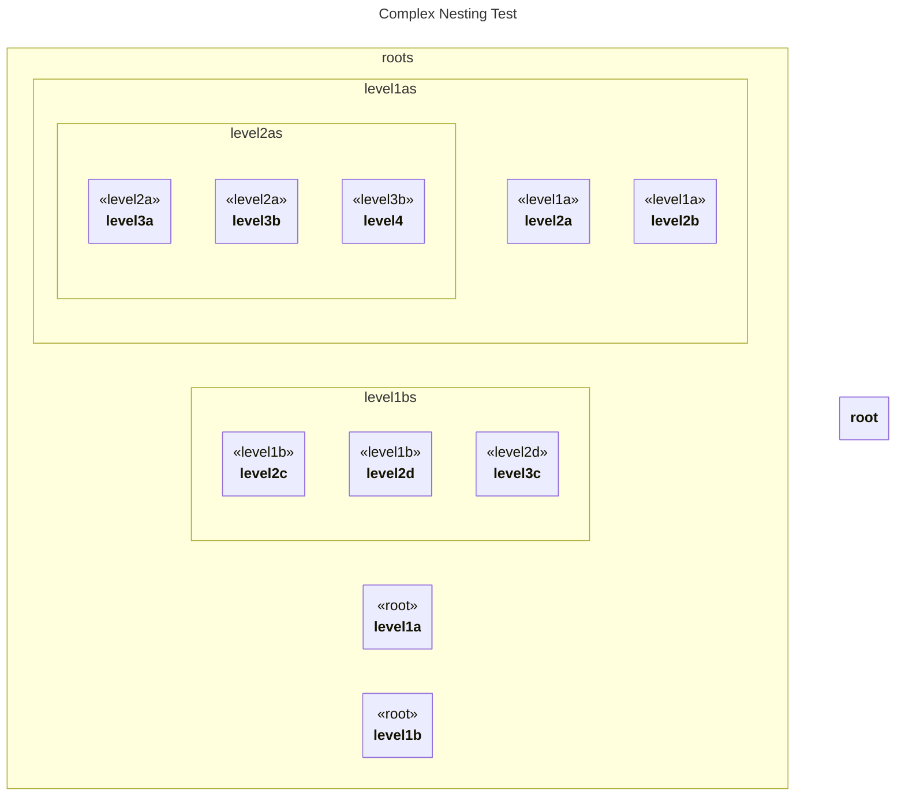

# Complex Nesting

## Source
```machine
machine "Complex Nesting Test"
root {
    level1a {
        level2a {
            level3a;
            level3b {
                level4;
            }
        }
        level2b;
    }
    level1b {
        level2c;
        level2d {
            level3c;
        }
    }
}
```

## Mermaid Output


## JSON Output
```json
{
  "title": "Complex Nesting Test",
  "nodes": [
    {
      "name": "root",
      "attributes": []
    },
    {
      "name": "level1a",
      "type": "root",
      "attributes": []
    },
    {
      "name": "level2a",
      "type": "level1a",
      "attributes": []
    },
    {
      "name": "level3a",
      "type": "level2a",
      "attributes": []
    },
    {
      "name": "level3b",
      "type": "level2a",
      "attributes": []
    },
    {
      "name": "level4",
      "type": "level3b",
      "attributes": []
    },
    {
      "name": "level2b",
      "type": "level1a",
      "attributes": []
    },
    {
      "name": "level1b",
      "type": "root",
      "attributes": []
    },
    {
      "name": "level2c",
      "type": "level1b",
      "attributes": []
    },
    {
      "name": "level2d",
      "type": "level1b",
      "attributes": []
    },
    {
      "name": "level3c",
      "type": "level2d",
      "attributes": []
    }
  ],
  "edges": []
}
```

## Validation Status
- Passed: true
- Parse Errors: 0
- Transform Errors: 0
- Completeness Issues: 0
- Losslessness Issues: 0
- Mermaid Parse Errors: 0
