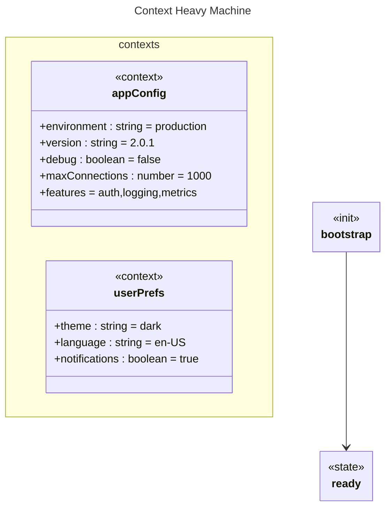

# Context Heavy

## Source
```machine
machine "Context Heavy Machine"
context appConfig {
    environment<string>: "production";
    version<string>: "2.0.1";
    debug<boolean>: false;
    maxConnections<number>: 1000;
    features: ["auth", "logging", "metrics"];
}

context userPrefs {
    theme<string>: "dark";
    language<string>: "en-US";
    notifications<boolean>: true;
}

init bootstrap;
state ready;

bootstrap -> ready;
```

## Mermaid Output


## JSON Output
```json
{
  "title": "Context Heavy Machine",
  "nodes": [
    {
      "name": "appConfig",
      "type": "context",
      "attributes": [
        {
          "name": "environment",
          "type": "string",
          "value": "\"production\""
        },
        {
          "name": "version",
          "type": "string",
          "value": "\"2.0.1\""
        },
        {
          "name": "debug",
          "type": "boolean",
          "value": "false"
        },
        {
          "name": "maxConnections",
          "type": "number",
          "value": "1000"
        },
        {
          "name": "features",
          "value": [
            "auth",
            "logging",
            "metrics"
          ]
        }
      ]
    },
    {
      "name": "userPrefs",
      "type": "context",
      "attributes": [
        {
          "name": "theme",
          "type": "string",
          "value": "\"dark\""
        },
        {
          "name": "language",
          "type": "string",
          "value": "\"en-US\""
        },
        {
          "name": "notifications",
          "type": "boolean",
          "value": "true"
        }
      ]
    },
    {
      "name": "bootstrap",
      "type": "init",
      "attributes": []
    },
    {
      "name": "ready",
      "type": "state",
      "attributes": []
    }
  ],
  "edges": [
    {
      "source": "bootstrap",
      "target": "ready",
      "arrowType": "->"
    }
  ],
  "inferredDependencies": []
}
```

## Validation Status
- Passed: true
- Parse Errors: 0
- Transform Errors: 0
- Completeness Issues: 0
- Losslessness Issues: 0
- Mermaid Parse Errors: 0
