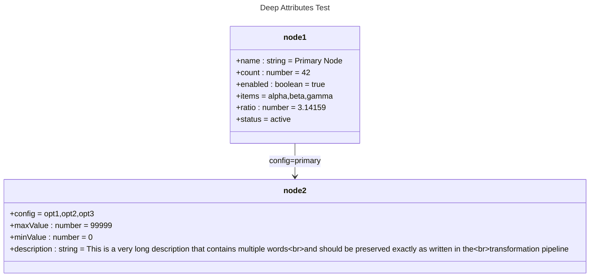

# Deep Attributes

## Source
```machine
machine "Deep Attributes Test"
node1 {
    name<string>: "Primary Node";
    count<number>: 42;
    enabled<boolean>: true;
    items: ["alpha", "beta", "gamma"];
    ratio<number>: 3.14159;
    status: "active";
}

node2 {
    config: ["opt1", "opt2", "opt3"];
    maxValue<number>: 99999;
    minValue<number>: 0;
    description<string>: "This is a very long description that contains multiple words and should be preserved exactly as written in the transformation pipeline";
}

node1 -config: "primary";-> node2;
```

## Mermaid Output


## JSON Output
```json
{
  "title": "Deep Attributes Test",
  "nodes": [
    {
      "name": "node1",
      "attributes": [
        {
          "name": "name",
          "type": "string",
          "value": "\"Primary Node\""
        },
        {
          "name": "count",
          "type": "number",
          "value": "42"
        },
        {
          "name": "enabled",
          "type": "boolean",
          "value": "true"
        },
        {
          "name": "items",
          "value": [
            "alpha",
            "beta",
            "gamma"
          ]
        },
        {
          "name": "ratio",
          "type": "number",
          "value": "3.14159"
        },
        {
          "name": "status",
          "value": "\"active\""
        }
      ]
    },
    {
      "name": "node2",
      "attributes": [
        {
          "name": "config",
          "value": [
            "opt1",
            "opt2",
            "opt3"
          ]
        },
        {
          "name": "maxValue",
          "type": "number",
          "value": "99999"
        },
        {
          "name": "minValue",
          "type": "number",
          "value": "0"
        },
        {
          "name": "description",
          "type": "string",
          "value": "\"This is a very long description that contains multiple words and should be preserved exactly as written in the transformation pipeline\""
        }
      ]
    }
  ],
  "edges": [
    {
      "source": "node1",
      "target": "node2",
      "value": {
        "text": "config: \"primary\";",
        "config": "primary"
      },
      "attributes": {
        "text": "config: \"primary\";",
        "config": "primary"
      },
      "arrowType": "->"
    }
  ],
  "notes": [],
  "inferredDependencies": []
}
```

## Validation Status
- Passed: true
- Parse Errors: 0
- Transform Errors: 0
- Completeness Issues: 0
- Losslessness Issues: 0
- Mermaid Parse Errors: 0
