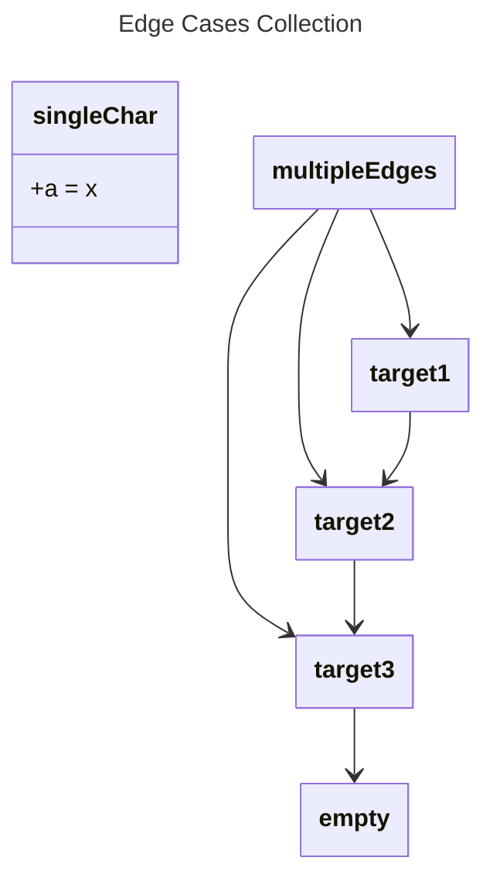

# Edge Cases Collection

## Source
```machine
machine "Edge Cases Collection"
empty;
singleChar {
    a: "x";
}

multipleEdges;
target1;
target2;
target3;

multipleEdges -> target1;
multipleEdges -> target2;
multipleEdges -> target3;

target1 -> target2 -> target3 -> empty;
```

## Mermaid Output


## JSON Output
```json
{
  "title": "Edge Cases Collection",
  "nodes": [
    {
      "name": "empty",
      "attributes": []
    },
    {
      "name": "singleChar",
      "attributes": [
        {
          "name": "a",
          "value": "\"x\""
        }
      ]
    },
    {
      "name": "multipleEdges",
      "attributes": []
    },
    {
      "name": "target1",
      "attributes": []
    },
    {
      "name": "target2",
      "attributes": []
    },
    {
      "name": "target3",
      "attributes": []
    }
  ],
  "edges": [
    {
      "source": "multipleEdges",
      "target": "target1"
    },
    {
      "source": "multipleEdges",
      "target": "target2"
    },
    {
      "source": "multipleEdges",
      "target": "target3"
    },
    {
      "source": "target1",
      "target": "target2"
    },
    {
      "source": "target2",
      "target": "target3"
    },
    {
      "source": "target3",
      "target": "empty"
    }
  ]
}
```

## Validation Status
- Passed: true
- Parse Errors: 0
- Transform Errors: 0
- Completeness Issues: 0
- Losslessness Issues: 0
- Mermaid Parse Errors: 0
