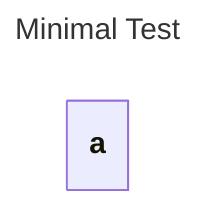

# Empty and Minimal

## Source
```machine
machine "Minimal Test"
a;
```

## Mermaid Output


## JSON Output
```json
{
  "title": "Minimal Test",
  "nodes": [
    {
      "name": "a",
      "attributes": []
    }
  ],
  "edges": [],
  "inferredDependencies": []
}
```

## Validation Status
- Passed: true
- Parse Errors: 0
- Transform Errors: 0
- Completeness Issues: 0
- Losslessness Issues: 0
- Mermaid Parse Errors: 0
