# Large Machine (50 nodes)

## Source
```machine
machine "Large Machine"
node0 {
    id<number>: 0;
    name<string>: "Node 0";
}
node1;
node2;
node3;
node4;
node5 {
    id<number>: 5;
    name<string>: "Node 5";
}
node6;
node7;
node8;
node9;
node10 {
    id<number>: 10;
    name<string>: "Node 10";
}
node11;
node12;
node13;
node14;
node15 {
    id<number>: 15;
    name<string>: "Node 15";
}
node16;
node17;
node18;
node19;
node20 {
    id<number>: 20;
    name<string>: "Node 20";
}
node21;
node22;
node23;
node24;
node25 {
    id<number>: 25;
    name<string>: "Node 25";
}
node26;
node27;
node28;
node29;
node30 {
    id<number>: 30;
    name<string>: "Node 30";
}
node31;
node32;
node33;
node34;
node35 {
    id<number>: 35;
    name<string>: "Node 35";
}
node36;
node37;
node38;
node39;
node40 {
    id<number>: 40;
    name<string>: "Node 40";
}
node41;
node42;
node43;
node44;
node45 {
    id<number>: 45;
    name<string>: "Node 45";
}
node46;
node47;
node48;
node49;

node0 -> node1;
node1 -> node2;
node2 -> node3;
node3 -> node4;
node4 -> node5;
node5 -> node6;
node6 -> node7;
node7 -> node8;
node8 -> node9;
node9 -> node10;
node10 -> node11;
node11 -> node12;
node12 -> node13;
node13 -> node14;
node14 -> node15;
node15 -> node16;
node16 -> node17;
node17 -> node18;
node18 -> node19;
node19 -> node20;
node20 -> node21;
node21 -> node22;
node22 -> node23;
node23 -> node24;
node24 -> node25;
node25 -> node26;
node26 -> node27;
node27 -> node28;
node28 -> node29;
node29 -> node30;
node30 -> node31;
node31 -> node32;
node32 -> node33;
node33 -> node34;
node34 -> node35;
node35 -> node36;
node36 -> node37;
node37 -> node38;
node38 -> node39;
node39 -> node40;
node40 -> node41;
node41 -> node42;
node42 -> node43;
node43 -> node44;
node44 -> node45;
node45 -> node46;
node46 -> node47;
node47 -> node48;
node48 -> node49;
node10 -> node5;
node20 -> node15;
node30 -> node25;
node40 -> node35;
node49 -> node0;
```

## Mermaid Output

```mermaid
---
"title": "Large Machine"
config:
    class:
        hideEmptyMembersBox: true
---
classDiagram-v2
    class node0 {
    
    +id : number = 0
+name : string = Node 0
  }

  class node1 {
    
  }

  class node2 {
    
  }

  class node3 {
    
  }

  class node4 {
    
  }

  class node5 {
    
    +id : number = 5
+name : string = Node 5
  }

  class node6 {
    
  }

  class node7 {
    
  }

  class node8 {
    
  }

  class node9 {
    
  }

  class node10 {
    
    +id : number = 10
+name : string = Node 10
  }

  class node11 {
    
  }

  class node12 {
    
  }

  class node13 {
    
  }

  class node14 {
    
  }

  class node15 {
    
    +id : number = 15
+name : string = Node 15
  }

  class node16 {
    
  }

  class node17 {
    
  }

  class node18 {
    
  }

  class node19 {
    
  }

  class node20 {
    
    +id : number = 20
+name : string = Node 20
  }

  class node21 {
    
  }

  class node22 {
    
  }

  class node23 {
    
  }

  class node24 {
    
  }

  class node25 {
    
    +id : number = 25
+name : string = Node 25
  }

  class node26 {
    
  }

  class node27 {
    
  }

  class node28 {
    
  }

  class node29 {
    
  }

  class node30 {
    
    +id : number = 30
+name : string = Node 30
  }

  class node31 {
    
  }

  class node32 {
    
  }

  class node33 {
    
  }

  class node34 {
    
  }

  class node35 {
    
    +id : number = 35
+name : string = Node 35
  }

  class node36 {
    
  }

  class node37 {
    
  }

  class node38 {
    
  }

  class node39 {
    
  }

  class node40 {
    
    +id : number = 40
+name : string = Node 40
  }

  class node41 {
    
  }

  class node42 {
    
  }

  class node43 {
    
  }

  class node44 {
    
  }

  class node45 {
    
    +id : number = 45
+name : string = Node 45
  }

  class node46 {
    
  }

  class node47 {
    
  }

  class node48 {
    
  }

  class node49 {
    
  }
    node0 --> node1

  node1 --> node2

  node2 --> node3

  node3 --> node4

  node4 --> node5

  node5 --> node6

  node6 --> node7

  node7 --> node8

  node8 --> node9

  node9 --> node10

  node10 --> node11

  node11 --> node12

  node12 --> node13

  node13 --> node14

  node14 --> node15

  node15 --> node16

  node16 --> node17

  node17 --> node18

  node18 --> node19

  node19 --> node20

  node20 --> node21

  node21 --> node22

  node22 --> node23

  node23 --> node24

  node24 --> node25

  node25 --> node26

  node26 --> node27

  node27 --> node28

  node28 --> node29

  node29 --> node30

  node30 --> node31

  node31 --> node32

  node32 --> node33

  node33 --> node34

  node34 --> node35

  node35 --> node36

  node36 --> node37

  node37 --> node38

  node38 --> node39

  node39 --> node40

  node40 --> node41

  node41 --> node42

  node42 --> node43

  node43 --> node44

  node44 --> node45

  node45 --> node46

  node46 --> node47

  node47 --> node48

  node48 --> node49

  node10 --> node5

  node20 --> node15

  node30 --> node25

  node40 --> node35

  node49 --> node0
  
  

```


## JSON Output
```json
{
  "title": "Large Machine",
  "nodes": [
    {
      "name": "node0",
      "attributes": [
        {
          "name": "id",
          "type": "number",
          "value": "0"
        },
        {
          "name": "name",
          "type": "string",
          "value": "\"Node 0\""
        }
      ]
    },
    {
      "name": "node1",
      "attributes": []
    },
    {
      "name": "node2",
      "attributes": []
    },
    {
      "name": "node3",
      "attributes": []
    },
    {
      "name": "node4",
      "attributes": []
    },
    {
      "name": "node5",
      "attributes": [
        {
          "name": "id",
          "type": "number",
          "value": "5"
        },
        {
          "name": "name",
          "type": "string",
          "value": "\"Node 5\""
        }
      ]
    },
    {
      "name": "node6",
      "attributes": []
    },
    {
      "name": "node7",
      "attributes": []
    },
    {
      "name": "node8",
      "attributes": []
    },
    {
      "name": "node9",
      "attributes": []
    },
    {
      "name": "node10",
      "attributes": [
        {
          "name": "id",
          "type": "number",
          "value": "10"
        },
        {
          "name": "name",
          "type": "string",
          "value": "\"Node 10\""
        }
      ]
    },
    {
      "name": "node11",
      "attributes": []
    },
    {
      "name": "node12",
      "attributes": []
    },
    {
      "name": "node13",
      "attributes": []
    },
    {
      "name": "node14",
      "attributes": []
    },
    {
      "name": "node15",
      "attributes": [
        {
          "name": "id",
          "type": "number",
          "value": "15"
        },
        {
          "name": "name",
          "type": "string",
          "value": "\"Node 15\""
        }
      ]
    },
    {
      "name": "node16",
      "attributes": []
    },
    {
      "name": "node17",
      "attributes": []
    },
    {
      "name": "node18",
      "attributes": []
    },
    {
      "name": "node19",
      "attributes": []
    },
    {
      "name": "node20",
      "attributes": [
        {
          "name": "id",
          "type": "number",
          "value": "20"
        },
        {
          "name": "name",
          "type": "string",
          "value": "\"Node 20\""
        }
      ]
    },
    {
      "name": "node21",
      "attributes": []
    },
    {
      "name": "node22",
      "attributes": []
    },
    {
      "name": "node23",
      "attributes": []
    },
    {
      "name": "node24",
      "attributes": []
    },
    {
      "name": "node25",
      "attributes": [
        {
          "name": "id",
          "type": "number",
          "value": "25"
        },
        {
          "name": "name",
          "type": "string",
          "value": "\"Node 25\""
        }
      ]
    },
    {
      "name": "node26",
      "attributes": []
    },
    {
      "name": "node27",
      "attributes": []
    },
    {
      "name": "node28",
      "attributes": []
    },
    {
      "name": "node29",
      "attributes": []
    },
    {
      "name": "node30",
      "attributes": [
        {
          "name": "id",
          "type": "number",
          "value": "30"
        },
        {
          "name": "name",
          "type": "string",
          "value": "\"Node 30\""
        }
      ]
    },
    {
      "name": "node31",
      "attributes": []
    },
    {
      "name": "node32",
      "attributes": []
    },
    {
      "name": "node33",
      "attributes": []
    },
    {
      "name": "node34",
      "attributes": []
    },
    {
      "name": "node35",
      "attributes": [
        {
          "name": "id",
          "type": "number",
          "value": "35"
        },
        {
          "name": "name",
          "type": "string",
          "value": "\"Node 35\""
        }
      ]
    },
    {
      "name": "node36",
      "attributes": []
    },
    {
      "name": "node37",
      "attributes": []
    },
    {
      "name": "node38",
      "attributes": []
    },
    {
      "name": "node39",
      "attributes": []
    },
    {
      "name": "node40",
      "attributes": [
        {
          "name": "id",
          "type": "number",
          "value": "40"
        },
        {
          "name": "name",
          "type": "string",
          "value": "\"Node 40\""
        }
      ]
    },
    {
      "name": "node41",
      "attributes": []
    },
    {
      "name": "node42",
      "attributes": []
    },
    {
      "name": "node43",
      "attributes": []
    },
    {
      "name": "node44",
      "attributes": []
    },
    {
      "name": "node45",
      "attributes": [
        {
          "name": "id",
          "type": "number",
          "value": "45"
        },
        {
          "name": "name",
          "type": "string",
          "value": "\"Node 45\""
        }
      ]
    },
    {
      "name": "node46",
      "attributes": []
    },
    {
      "name": "node47",
      "attributes": []
    },
    {
      "name": "node48",
      "attributes": []
    },
    {
      "name": "node49",
      "attributes": []
    }
  ],
  "edges": [
    {
      "source": "node0",
      "target": "node1",
      "arrowType": "->"
    },
    {
      "source": "node1",
      "target": "node2",
      "arrowType": "->"
    },
    {
      "source": "node2",
      "target": "node3",
      "arrowType": "->"
    },
    {
      "source": "node3",
      "target": "node4",
      "arrowType": "->"
    },
    {
      "source": "node4",
      "target": "node5",
      "arrowType": "->"
    },
    {
      "source": "node5",
      "target": "node6",
      "arrowType": "->"
    },
    {
      "source": "node6",
      "target": "node7",
      "arrowType": "->"
    },
    {
      "source": "node7",
      "target": "node8",
      "arrowType": "->"
    },
    {
      "source": "node8",
      "target": "node9",
      "arrowType": "->"
    },
    {
      "source": "node9",
      "target": "node10",
      "arrowType": "->"
    },
    {
      "source": "node10",
      "target": "node11",
      "arrowType": "->"
    },
    {
      "source": "node11",
      "target": "node12",
      "arrowType": "->"
    },
    {
      "source": "node12",
      "target": "node13",
      "arrowType": "->"
    },
    {
      "source": "node13",
      "target": "node14",
      "arrowType": "->"
    },
    {
      "source": "node14",
      "target": "node15",
      "arrowType": "->"
    },
    {
      "source": "node15",
      "target": "node16",
      "arrowType": "->"
    },
    {
      "source": "node16",
      "target": "node17",
      "arrowType": "->"
    },
    {
      "source": "node17",
      "target": "node18",
      "arrowType": "->"
    },
    {
      "source": "node18",
      "target": "node19",
      "arrowType": "->"
    },
    {
      "source": "node19",
      "target": "node20",
      "arrowType": "->"
    },
    {
      "source": "node20",
      "target": "node21",
      "arrowType": "->"
    },
    {
      "source": "node21",
      "target": "node22",
      "arrowType": "->"
    },
    {
      "source": "node22",
      "target": "node23",
      "arrowType": "->"
    },
    {
      "source": "node23",
      "target": "node24",
      "arrowType": "->"
    },
    {
      "source": "node24",
      "target": "node25",
      "arrowType": "->"
    },
    {
      "source": "node25",
      "target": "node26",
      "arrowType": "->"
    },
    {
      "source": "node26",
      "target": "node27",
      "arrowType": "->"
    },
    {
      "source": "node27",
      "target": "node28",
      "arrowType": "->"
    },
    {
      "source": "node28",
      "target": "node29",
      "arrowType": "->"
    },
    {
      "source": "node29",
      "target": "node30",
      "arrowType": "->"
    },
    {
      "source": "node30",
      "target": "node31",
      "arrowType": "->"
    },
    {
      "source": "node31",
      "target": "node32",
      "arrowType": "->"
    },
    {
      "source": "node32",
      "target": "node33",
      "arrowType": "->"
    },
    {
      "source": "node33",
      "target": "node34",
      "arrowType": "->"
    },
    {
      "source": "node34",
      "target": "node35",
      "arrowType": "->"
    },
    {
      "source": "node35",
      "target": "node36",
      "arrowType": "->"
    },
    {
      "source": "node36",
      "target": "node37",
      "arrowType": "->"
    },
    {
      "source": "node37",
      "target": "node38",
      "arrowType": "->"
    },
    {
      "source": "node38",
      "target": "node39",
      "arrowType": "->"
    },
    {
      "source": "node39",
      "target": "node40",
      "arrowType": "->"
    },
    {
      "source": "node40",
      "target": "node41",
      "arrowType": "->"
    },
    {
      "source": "node41",
      "target": "node42",
      "arrowType": "->"
    },
    {
      "source": "node42",
      "target": "node43",
      "arrowType": "->"
    },
    {
      "source": "node43",
      "target": "node44",
      "arrowType": "->"
    },
    {
      "source": "node44",
      "target": "node45",
      "arrowType": "->"
    },
    {
      "source": "node45",
      "target": "node46",
      "arrowType": "->"
    },
    {
      "source": "node46",
      "target": "node47",
      "arrowType": "->"
    },
    {
      "source": "node47",
      "target": "node48",
      "arrowType": "->"
    },
    {
      "source": "node48",
      "target": "node49",
      "arrowType": "->"
    },
    {
      "source": "node10",
      "target": "node5",
      "arrowType": "->"
    },
    {
      "source": "node20",
      "target": "node15",
      "arrowType": "->"
    },
    {
      "source": "node30",
      "target": "node25",
      "arrowType": "->"
    },
    {
      "source": "node40",
      "target": "node35",
      "arrowType": "->"
    },
    {
      "source": "node49",
      "target": "node0",
      "arrowType": "->"
    }
  ],
  "notes": [],
  "inferredDependencies": []
}
```

## Validation Status
- Passed: true
- Parse Errors: 0
- Transform Errors: 0
- Completeness Issues: 0
- Losslessness Issues: 0
- Mermaid Parse Errors: 0
