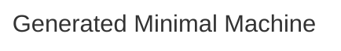

# Minimal Machine

## Source
```machine
machine "Generated Minimal Machine"
```

## Mermaid Output


## JSON Output
```json
{
  "title": "Generated Minimal Machine",
  "nodes": [],
  "edges": [],
  "notes": [],
  "inferredDependencies": []
}
```

## Validation Status
- Passed: true
- Parse Errors: 0
- Transform Errors: 0
- Completeness Issues: 0
- Losslessness Issues: 0
- Mermaid Parse Errors: 0
