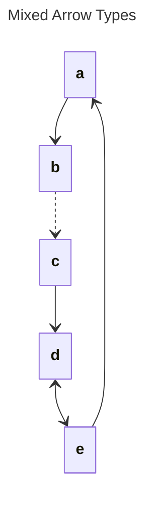

# Mixed Arrow Types

## Source
```machine
machine "Mixed Arrow Types"
a;
b;
c;
d;
e;

a -> b;
b --> c;
c => d;
d <--> e;
e -> a;
```

## Mermaid Output


## JSON Output
```json
{
  "title": "Mixed Arrow Types",
  "nodes": [
    {
      "name": "a",
      "attributes": []
    },
    {
      "name": "b",
      "attributes": []
    },
    {
      "name": "c",
      "attributes": []
    },
    {
      "name": "d",
      "attributes": []
    },
    {
      "name": "e",
      "attributes": []
    }
  ],
  "edges": [
    {
      "source": "a",
      "target": "b",
      "arrowType": "->"
    },
    {
      "source": "b",
      "target": "c",
      "arrowType": "-->"
    },
    {
      "source": "c",
      "target": "d",
      "arrowType": "=>"
    },
    {
      "source": "d",
      "target": "e",
      "arrowType": "<-->"
    },
    {
      "source": "e",
      "target": "a",
      "arrowType": "->"
    }
  ],
  "inferredDependencies": []
}
```

## Validation Status
- Passed: true
- Parse Errors: 0
- Transform Errors: 0
- Completeness Issues: 0
- Losslessness Issues: 0
- Mermaid Parse Errors: 0
