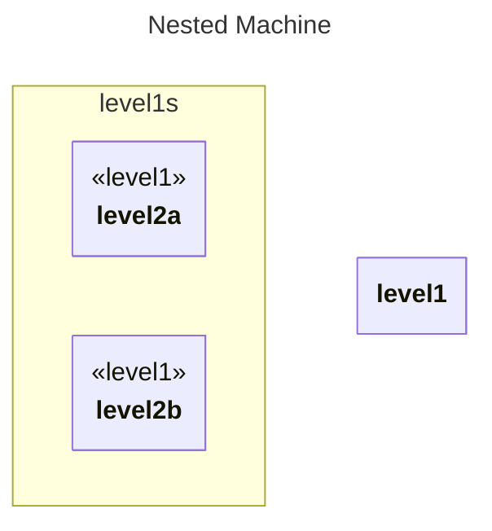

# Nested (2 levels)

## Source
```machine
machine "Nested Machine"
level1 {
    level2a;
    level2b;
}
```

## Mermaid Output


## JSON Output
```json
{
  "title": "Nested Machine",
  "nodes": [
    {
      "name": "level1",
      "attributes": []
    },
    {
      "name": "level2a",
      "type": "level1",
      "attributes": []
    },
    {
      "name": "level2b",
      "type": "level1",
      "attributes": []
    }
  ],
  "edges": []
}
```

## Validation Status
- Passed: true
- Parse Errors: 0
- Transform Errors: 0
- Completeness Issues: 0
- Losslessness Issues: 0
- Mermaid Parse Errors: 0
