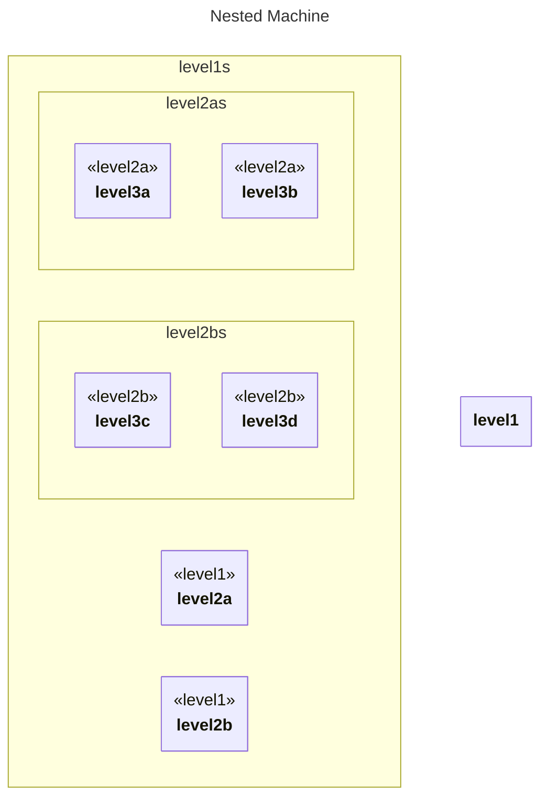

# Nested (3 levels)

## Source
```machine
machine "Nested Machine"
level1 {
    level2a {
        level3a;
        level3b;
    }
    level2b {
        level3c;
        level3d;
    }
}
```

## Mermaid Output


## JSON Output
```json
{
  "title": "Nested Machine",
  "nodes": [
    {
      "name": "level1",
      "attributes": []
    },
    {
      "name": "level2a",
      "type": "level1",
      "attributes": []
    },
    {
      "name": "level3a",
      "type": "level2a",
      "attributes": []
    },
    {
      "name": "level3b",
      "type": "level2a",
      "attributes": []
    },
    {
      "name": "level2b",
      "type": "level1",
      "attributes": []
    },
    {
      "name": "level3c",
      "type": "level2b",
      "attributes": []
    },
    {
      "name": "level3d",
      "type": "level2b",
      "attributes": []
    }
  ],
  "edges": []
}
```

## Validation Status
- Passed: true
- Parse Errors: 0
- Transform Errors: 0
- Completeness Issues: 0
- Losslessness Issues: 0
- Mermaid Parse Errors: 0
