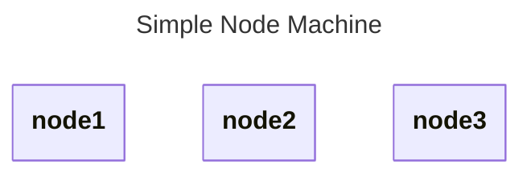

# Simple Nodes (3)

## Source
```machine
machine "Simple Node Machine"
node1;
node2;
node3;
```

## Mermaid Output


## JSON Output
```json
{
  "title": "Simple Node Machine",
  "nodes": [
    {
      "name": "node1",
      "attributes": []
    },
    {
      "name": "node2",
      "attributes": []
    },
    {
      "name": "node3",
      "attributes": []
    }
  ],
  "edges": []
}
```

## Validation Status
- Passed: true
- Parse Errors: 0
- Transform Errors: 0
- Completeness Issues: 0
- Losslessness Issues: 0
- Mermaid Parse Errors: 0
