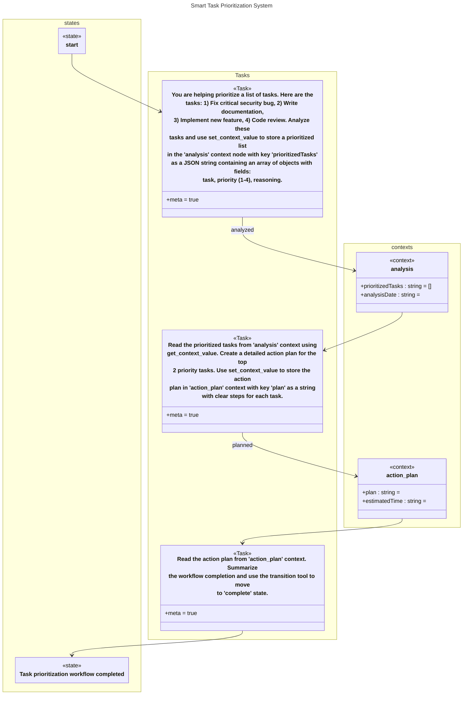

# Smart Task Prioritizer (Context Management)

## Source
```machine
machine "Smart Task Prioritization System"

// A practical workflow that analyzes and prioritizes tasks using AI

state start;

Task analyze_tasks {
    meta: true;
    prompt: "You are helping prioritize a list of tasks. Here are the tasks: 1) Fix critical security bug, 2) Write documentation, 3) Implement new feature, 4) Code review. Analyze these tasks and use set_context_value to store a prioritized list in the 'analysis' context node with key 'prioritizedTasks' as a JSON string containing an array of objects with fields: task, priority (1-4), reasoning.";
};

context analysis {
    prioritizedTasks<string>: "[]";
    analysisDate<string>: "";
};

Task generate_action_plan {
    meta: true;
    prompt: "Read the prioritized tasks from 'analysis' context using get_context_value. Create a detailed action plan for the top 2 priority tasks. Use set_context_value to store the action plan in 'action_plan' context with key 'plan' as a string with clear steps for each task.";
};

context action_plan {
    plan<string>: "";
    estimatedTime<string>: "";
};

Task finalize {
    meta: true;
    prompt: "Read the action plan from 'action_plan' context. Summarize the workflow completion and use the transition tool to move to 'complete' state.";
};

state complete {
    desc: "Task prioritization workflow completed";
};

// Workflow
start -> analyze_tasks;
analyze_tasks -analyzed-> analysis;
analysis -> generate_action_plan;
generate_action_plan -planned-> action_plan;
action_plan -> finalize;
finalize -> complete;

```

## Mermaid Output


## JSON Output
```json
{
  "title": "Smart Task Prioritization System",
  "nodes": [
    {
      "name": "start",
      "type": "state",
      "attributes": []
    },
    {
      "name": "analyze_tasks",
      "type": "Task",
      "attributes": [
        {
          "name": "meta",
          "value": "true"
        },
        {
          "name": "prompt",
          "value": "You are helping prioritize a list of tasks. Here are the tasks: 1) Fix critical security bug, 2) Write documentation, 3) Implement new feature, 4) Code review. Analyze these tasks and use set_context_value to store a prioritized list in the 'analysis' context node with key 'prioritizedTasks' as a JSON string containing an array of objects with fields: task, priority (1-4), reasoning."
        }
      ]
    },
    {
      "name": "analysis",
      "type": "context",
      "attributes": [
        {
          "name": "prioritizedTasks",
          "type": "string",
          "value": "[]"
        },
        {
          "name": "analysisDate",
          "type": "string",
          "value": ""
        }
      ]
    },
    {
      "name": "generate_action_plan",
      "type": "Task",
      "attributes": [
        {
          "name": "meta",
          "value": "true"
        },
        {
          "name": "prompt",
          "value": "Read the prioritized tasks from 'analysis' context using get_context_value. Create a detailed action plan for the top 2 priority tasks. Use set_context_value to store the action plan in 'action_plan' context with key 'plan' as a string with clear steps for each task."
        }
      ]
    },
    {
      "name": "action_plan",
      "type": "context",
      "attributes": [
        {
          "name": "plan",
          "type": "string",
          "value": ""
        },
        {
          "name": "estimatedTime",
          "type": "string",
          "value": ""
        }
      ]
    },
    {
      "name": "finalize",
      "type": "Task",
      "attributes": [
        {
          "name": "meta",
          "value": "true"
        },
        {
          "name": "prompt",
          "value": "Read the action plan from 'action_plan' context. Summarize the workflow completion and use the transition tool to move to 'complete' state."
        }
      ]
    },
    {
      "name": "complete",
      "type": "state",
      "attributes": [
        {
          "name": "desc",
          "value": "Task prioritization workflow completed"
        }
      ]
    }
  ],
  "edges": [
    {
      "source": "start",
      "target": "analyze_tasks",
      "arrowType": "->"
    },
    {
      "source": "analyze_tasks",
      "target": "analysis",
      "value": {
        "text": "analyzed"
      },
      "attributes": {
        "text": "analyzed"
      },
      "arrowType": "->"
    },
    {
      "source": "analysis",
      "target": "generate_action_plan",
      "arrowType": "->"
    },
    {
      "source": "generate_action_plan",
      "target": "action_plan",
      "value": {
        "text": "planned"
      },
      "attributes": {
        "text": "planned"
      },
      "arrowType": "->"
    },
    {
      "source": "action_plan",
      "target": "finalize",
      "arrowType": "->"
    },
    {
      "source": "finalize",
      "target": "complete",
      "arrowType": "->"
    }
  ],
  "notes": [],
  "inferredDependencies": []
}
```

## Validation Status
- Passed: true
- Parse Errors: 0
- Transform Errors: 0
- Completeness Issues: 0
- Losslessness Issues: 0
- Mermaid Parse Errors: 0
