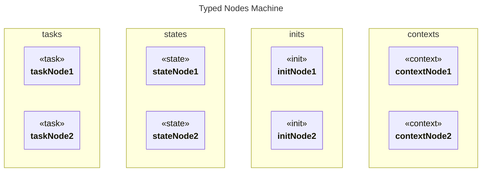

# Typed Nodes

## Source
```machine
machine "Typed Nodes Machine"
task taskNode1;
task taskNode2;
state stateNode1;
state stateNode2;
init initNode1;
init initNode2;
context contextNode1;
context contextNode2;
```

## Mermaid Output


## JSON Output
```json
{
  "title": "Typed Nodes Machine",
  "nodes": [
    {
      "name": "taskNode1",
      "type": "task",
      "attributes": []
    },
    {
      "name": "taskNode2",
      "type": "task",
      "attributes": []
    },
    {
      "name": "stateNode1",
      "type": "state",
      "attributes": []
    },
    {
      "name": "stateNode2",
      "type": "state",
      "attributes": []
    },
    {
      "name": "initNode1",
      "type": "init",
      "attributes": []
    },
    {
      "name": "initNode2",
      "type": "init",
      "attributes": []
    },
    {
      "name": "contextNode1",
      "type": "context",
      "attributes": []
    },
    {
      "name": "contextNode2",
      "type": "context",
      "attributes": []
    }
  ],
  "edges": [],
  "notes": [],
  "inferredDependencies": []
}
```

## Validation Status
- Passed: true
- Parse Errors: 0
- Transform Errors: 0
- Completeness Issues: 0
- Losslessness Issues: 0
- Mermaid Parse Errors: 0
