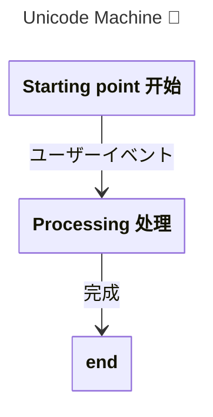

# Unicode Machine

## Source
```machine
machine "Unicode Machine 🔄"
start "開始" {
    desc: "Starting point 开始";
}
process "処理" {
    desc: "Processing 处理";
}
end "終了";

start -"ユーザーイベント"-> process;
process -"完成"-> end;
```

## Mermaid Output


## JSON Output
```json
{
  "title": "Unicode Machine 🔄",
  "nodes": [
    {
      "name": "start",
      "attributes": [
        {
          "name": "desc",
          "value": "\"Starting point 开始\""
        }
      ]
    },
    {
      "name": "process",
      "attributes": [
        {
          "name": "desc",
          "value": "\"Processing 处理\""
        }
      ]
    },
    {
      "name": "end",
      "attributes": []
    }
  ],
  "edges": [
    {
      "source": "start",
      "target": "process",
      "value": {
        "text": "ユーザーイベント"
      },
      "attributes": {
        "text": "ユーザーイベント"
      }
    },
    {
      "source": "process",
      "target": "end",
      "value": {
        "text": "完成"
      },
      "attributes": {
        "text": "完成"
      }
    }
  ]
}
```

## Validation Status
- Passed: true
- Parse Errors: 0
- Transform Errors: 0
- Completeness Issues: 0
- Losslessness Issues: 0
- Mermaid Parse Errors: 0
