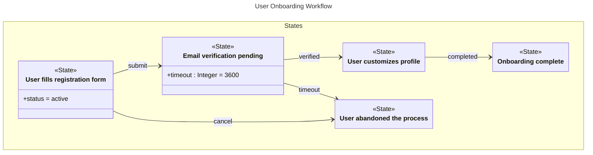

# User Onboarding

## Source
```machine
machine "User Onboarding Workflow"

// Define states
State registration {
    desc: "User fills registration form";
    status: "active";
};

State email_verification {
    desc: "Email verification pending";
    timeout<Integer>: 3600;
};

State profile_setup {
    desc: "User customizes profile";
};

State complete {
    desc: "Onboarding complete";
};

State abandoned {
    desc: "User abandoned the process";
};

// Define the workflow
registration -submit-> email_verification;
email_verification -verified-> profile_setup;
profile_setup -completed-> complete;

// Handle edge cases
email_verification -timeout-> abandoned;
registration -cancel-> abandoned;

```

## Mermaid Output


## JSON Output
```json
{
  "title": "User Onboarding Workflow",
  "nodes": [
    {
      "name": "registration",
      "type": "State",
      "attributes": [
        {
          "name": "desc",
          "value": "\"User fills registration form\""
        },
        {
          "name": "status",
          "value": "\"active\""
        }
      ]
    },
    {
      "name": "email_verification",
      "type": "State",
      "attributes": [
        {
          "name": "desc",
          "value": "\"Email verification pending\""
        },
        {
          "name": "timeout",
          "type": "Integer",
          "value": "3600"
        }
      ]
    },
    {
      "name": "profile_setup",
      "type": "State",
      "attributes": [
        {
          "name": "desc",
          "value": "\"User customizes profile\""
        }
      ]
    },
    {
      "name": "complete",
      "type": "State",
      "attributes": [
        {
          "name": "desc",
          "value": "\"Onboarding complete\""
        }
      ]
    },
    {
      "name": "abandoned",
      "type": "State",
      "attributes": [
        {
          "name": "desc",
          "value": "\"User abandoned the process\""
        }
      ]
    }
  ],
  "edges": [
    {
      "source": "registration",
      "target": "email_verification",
      "value": {
        "text": "submit"
      },
      "attributes": {
        "text": "submit"
      },
      "arrowType": "->"
    },
    {
      "source": "email_verification",
      "target": "profile_setup",
      "value": {
        "text": "verified"
      },
      "attributes": {
        "text": "verified"
      },
      "arrowType": "->"
    },
    {
      "source": "profile_setup",
      "target": "complete",
      "value": {
        "text": "completed"
      },
      "attributes": {
        "text": "completed"
      },
      "arrowType": "->"
    },
    {
      "source": "email_verification",
      "target": "abandoned",
      "value": {
        "text": "timeout"
      },
      "attributes": {
        "text": "timeout"
      },
      "arrowType": "->"
    },
    {
      "source": "registration",
      "target": "abandoned",
      "value": {
        "text": "cancel"
      },
      "attributes": {
        "text": "cancel"
      },
      "arrowType": "->"
    }
  ],
  "inferredDependencies": []
}
```

## Validation Status
- Passed: true
- Parse Errors: 0
- Transform Errors: 0
- Completeness Issues: 0
- Losslessness Issues: 0
- Mermaid Parse Errors: 0
